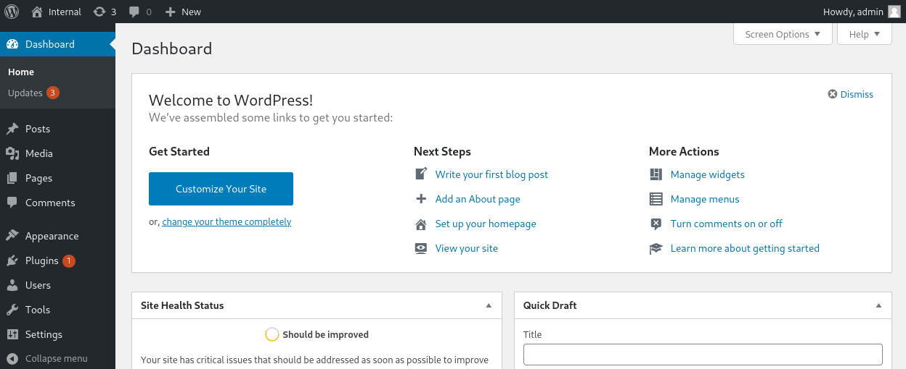

# Internal

## Pre-engagement

## Scanning
Per instruction I modified my host file to reflect internal.thm. You can do that with the following command: `sudo nano /etc/hosts`

Then I ran  a Threader 3000 scan to get a quick overview of what to expect on this network, followed by a conveniently suggested nmap scan.  

Threader 3000 results:

nmap results:

Looking at http://internal.thm we see there is the default apache 2 web server that doesn't appear to be set up. So from here I'm going to run Gobuster to see if there's any directories associated with this server that may offer more intel. 

## Discovery

Gobuster results:

Visiting one of our results from the Gobuster scan http://internal.thm/blog we see there is a WordPress site running. 

If you scroll down, you'll see a login link.

For WordPress a typical default credential you'll find is "admin:password"

These credentials didn't work, but it did reveal, via a verbose error, that "admin" is a valid username. So now our next goal is to figure out the password for this account. A handy tool for WordPress brute-forcing is WPScan. 
WPScan results:

Now we have access to the administrator account for this WordPress site. 
## WordPress access 

Login to admin portal:

Being somewhat familiar with exploiting WordPress sites, I had an idea of what to do from here, but for the sake of thoroughness I decided to have a look around to see what intel could be gathered. 

From the dashboard we can see what version of WordPress is running.
WP version 5.4.2

Looking at the posts we can see there is a private untitled post. 

Investigating this private post we find potentially exploitable information in a note exposing a set of possibly still valid credentials for the user William:

Since we know port 22 and 80 are open, I tried using these credentials for both the WordPress site and to SSH via port 22. Neither worked, so my assumption is either they've already been changed or they're for a different service we have yet to discover. Either way, we'll save these for later and reorient towards our WordPress exploitation. 

## Exploiting WordPress

Let's log back in as admin for internal.thm/blog and attempt an exploit I'm familiar with: RCE via the 404 Template. We're going to be uploading a PHP reverse shell to the site's 404 Template. The idea here is that the 404 Template is written in PHP, so if you can replace it with your PHP reverse shell script which directs a connection to your listener, you just have to visit that page to activate the connection. 

Start by navigating to the 404 Template: Appearance -> Theme Editor -> 404 Template

Appearance

Theme Editor

404 Template

Here I'll be using the PHP PentestMonkey script you can find at https://revshells.com
This is a great resource for quickly modifying some reverse shell scripts to fit your IP/PORT of choice. 
All you need to do is adjust the IP to your ATTACK_IP and the port  that you want to use for your Netcat listener. Then just scroll down and copy that script. Replace the script in the 404 Template with the script you just copied and click "update file." You should see a successful update notification. 

Set up your Netcat listener on your local machine with the following command: `nc -lvnp 4445`

To visit the 404 page/ activate the reverse shell, visit the following:

## PHP Reverse Shell Access

 Once activated, our listener should pick up the connection. From there I like to upgrade my shell, if I can, with the following:
`python -c 'import pty;pty.spawn("/bin/bash")'
`stty raw -echo`

We can see now that we have access as "www-data" a low-privileged user account typically used by web server software.
After minimal searching we can see in home folder there is a user "aubreanna." We don't have permissions to view this user's folder.  

Continuing the search, we find a file "wp-save.txt" in the /opt folder. The /opt folder in Linux distributions is typically used for installing optional or add-on software packages, making this an interesting find. 

Here we found a note for "Bill" containing Aubreanna's credentials.
Now we can SSH into the server and go see what was in Aubreanna's folder. 

## User.txt

After logging in as Aubreanna, we have secured our first objective: the flag in user.txt

Our first flag isn't all we found. The file jenkins.txt reveals some insightful details about the network structure. Jenkins is a is a tool that helps automate the process of building, testing, and deploying software. It is likely running on a private, non-routable IP address within the internal network, which we won't have access to via the internet. 

For the sake of thoroughness I crossed a few other things off my checklist:
- no cronjobs running on aurbreanna or www-data profiles
- no other named users in /etc/passwd
- Aubreanna's credentials are not valid for http://internal.thm/blog

## Tunneling

Our next step:
To access the internal Jenkins service at 172.17.0.2:8080, we'll use Aubreanna's SSH connection to create a tunnel, forwarding traffic from our local machine's port 4444 through her connection to the internal Jenkins service.

`ssh -L 0.0.0.0:4444:172.17.0.2:8080 aubreanna@internal.thm`

## Jenkins Service

Access the Jenkins login portal in your web browser by visiting http://localhost:4444

The default credentials for Jenkins won't work and the errors are not verbose like we found on the WordPress site previously. Here I'm going to assume the password has been changed and not the username for the admin account in the hopes we can gain access more quickly. For this I will be using Hydra, which requires a little work to find the right parameters. 

Gather required parameters:
- request type
- error code
- username/password parameters
- directory

Most of this can be found intercepting the HTTP request with Burp Suite:

The error code can be found by forward the request or simply attempting to login with invalid credentials via the Jenkins portal:

Giving us the following hydra command:

`hydra -l admin -P /usr/share/wordlists/rockyou.txt 0.0.0.0 -s 4444 http-post-form "/j_acegi_security:j_username=^USER^&j_password=^PASS^&from=%2F&Submit=Sign+in:Invalid username or password" -t 30`

Understanding the Hydra command:
- **`-l admin`**: Specifies the username (`admin`) to be tested.
- **`-P /usr/share/wordlists/rockyou.txt`**: Points to the password list (`rockyou.txt`) that will be used for the brute-force attack.
- **`0.0.0.0`**: The target IP address of the service to attack.
- **`-s 4444`**: The port number (`4444`) on which the service is running.
- **`http-post-form`**: Specifies the method used to submit the login form (in this case, a POST request).
- **`"/j_acegi_security:j_username=^USER^&j_password=^PASS^&from=%2F&Submit=Sign+in:Invalid username or password"`**:
  - **`/j_acegi_security`**: The directory path of the login form.
  - **`j_username=^USER^&j_password=^PASS^&from=%2F&Submit=Sign+in`**: The parameters sent in the POST request, with `^USER^` and `^PASS^` placeholders for Hydra to insert the username and password. In this case `^USER^` will be replaced with `admin` and `^PASS^` will be replaced with words from our `rockyou.txt` wordlist.
  - **`Invalid username or password`**: The error message that indicates a failed login attempt, used by Hydra to determine unsuccessful brute-force attempts.
- **`-t 30`**: Specifies the number of concurrent threads to speed up the attack.

Since Hydra was able to find a password, let's login to Jenkins. If you're looking to exploit Jenkins, a great reference is https://cloud.hacktricks.xyz/pentesting-ci-cd/jenkins-security, which is where found the vulnerability we're going to exploit next: RCE via Jenkins Groovy script console.

## Jenkins Groovy Exploit

Navigate to the Manage Jenkins tab.

Then scroll down to the Tools and Actions section and click on Script Console.

Here is where we'll place our reverse shell script for RCE.

In your browser go back to https://revshell.com and navigate down to the Groovy script. Modify it just like we did for the previous PHP PentestMonkey script with your local IP and a port of your choice. Make sure to remember to start a listener on your machine. 

Copy and paste the script into the Groovy Script Console, set your listener, and run the script.
## Groovy Reverse Shell Access

Now you should have access as Jenkins via a shell in your terminal.  From here you'll need to search around a bit to find the next pivot point. If you navigate to the `/opt` folder, you will again find an interesting file that doesn't seem to belong called `note.txt`
Take a look at it with `cat note.txt` and you'll find the root user's credentials. 

## Root Access

Now all that's left is to ssh into the server as root and secure the second flag in `root.txt`

---

# **Penetration Test Report: Internal System (TryHackMe "Internal")**

## **Executive Summary**

The security assessment conducted on the internal system identified several critical vulnerabilities within web application services and internal server configurations. During the test, attackers could easily gain unauthorized access to key services like WordPress and Jenkins due to weak credentials and misconfigurations, leading to system compromise, privilege escalation, and root access.

By exploiting these vulnerabilities, a malicious actor could achieve remote code execution (RCE) and gain full control over critical systems, allowing access to sensitive files and potentially causing a significant security breach. The vulnerabilities discovered present an immediate risk, as an attacker with a novice skill-set could replicate this compromise.

## **Vulnerability and Exploitation Assessment**

### 1. **Weak WordPress Credentials (CWE-521: Weak Password Requirements)**

- **Type of Vulnerability**: OWASP A2:2017 - Broken Authentication
- **CVSS Score**: 7.5 (High)
- **Description**: The WordPress site running on the target was protected by weak credentials, using a common administrative username (`admin`) and an easily brute-forced password. A brute-force attack using WPScan successfully uncovered the credentials quickly.
- **Exploitation**: The attacker brute-forced the WordPress admin account and uploaded a malicious PHP reverse shell script using the 404 Template Editor feature. This enabled the attacker to remotely execute code on the system with the privileges of the web server (www-data).
- **Impact**: Gaining administrator access to the WordPress dashboard allowed the attacker to upload a reverse shell, leading to a foothold on the internal server.

### 2. **Insecure Jenkins Configuration (CWE-287: Improper Authentication)**

- **Type of Vulnerability**: OWASP A5:2017 - Security Misconfiguration
- **CVSS Score**: 8.0 (High)
- **Description**: The Jenkins Continuous Integration (CI) tool was exposed on an internal IP address with inadequate access control mechanisms. By exploiting default or weak credentials, the attacker was able to access the administrative panel and execute arbitrary code.
- **Exploitation**: The attacker brute-forced the Jenkins admin credentials using Hydra. Once inside, the attacker leveraged the Groovy Script Console to execute a reverse shell script, gaining remote code execution (RCE) and deepening the system compromise.
- **Impact**: The attacker gained full control of Jenkins and was able to explore the internal network, leading to access to sensitive data and credentials stored within the system.

### 3. **Stored Plaintext Credentials (CWE-256: Unprotected Storage of Credentials)**

- **Type of Vulnerability**: OWASP A3:2017 - Sensitive Data Exposure
- **CVSS Score**: 7.8 (High)
- **Description**: During exploration, credentials for the root user were found stored in plaintext within a file on the system (`note.txt` under /opt directory). These credentials allowed direct SSH access to the root user.
- **Exploitation**: After pivoting through Jenkins and finding the credentials stored in plaintext, the attacker was able to log in via SSH as the root user, gaining full administrative control of the system.
- **Impact**: Full root access was achieved, allowing the attacker to manipulate system files, exfiltrate sensitive data, and escalate privileges beyond the intended access controls.

## **Remediation Suggestions**

### 1. **Strengthen Credential Policies**

- **Action**: Enforce strong password policies across all web services and internal systems. Passwords are recommended to have a minimum entropy score of 80 bits for protection against brute-forcing. These passwords should not be reused and they should be changed often. Implement account lockout mechanisms after multiple failed login attempts to prevent brute-force attacks.
- **Implementation**: Use password management tools, enforce password complexity requirements in WordPress and Jenkins, and encourage users to adopt secure credential management practices.

### 2. **Secure Web Application Services**

- **Action**: Ensure that all web applications, such as WordPress, are updated regularly to the latest versions. Disable editing of themes or templates directly from the WordPress admin panel, as this feature can be exploited to execute malicious code. Implement multi-factor authentication (MFA) for all admin-level accounts.
- **Implementation**: Regularly audit web applications for outdated plugins or themes and employ a web application firewall (WAF) to block unauthorized access attempts.

### 3. **Harden Jenkins Security**

- **Action**: Limit access to Jenkins to trusted internal IPs or through a VPN to reduce exposure. Ensure strong authentication mechanisms are in place and disable administrative features such as the Groovy Script Console unless absolutely necessary. Regularly rotate Jenkins credentials and apply role-based access control (RBAC) to limit permissions.
- **Implementation**: Restrict administrative functions to trusted users, conduct regular vulnerability assessments of the Jenkins environment, and limit the use of remote code execution features.

### 4. **Protect Sensitive Data Storage**

- **Action**: Remove plaintext storage of sensitive data, including user credentials, on the filesystem. Encrypt sensitive information at rest and in transit. Ensure that credentials are stored in secure vaults and rotated frequently to reduce the risk of exposure.
- **Implementation**: Use secure storage solutions such as HashiCorp Vault or AWS Secrets Manager for managing sensitive credentials. Audit systems regularly to ensure that no sensitive data is stored in plaintext or unprotected directories.

### 5. **Network Segmentation and Monitoring**

- **Action**: Segment critical services such as Jenkins and WordPress into different network zones to prevent lateral movement by attackers. Implement network monitoring and logging to detect any suspicious activities and respond in real time.
- **Implementation**: Use intrusion detection and prevention systems (IDS/IPS) to monitor traffic and set up alerting systems for anomalous behavior. Review firewall rules to ensure that only necessary services are exposed, and limit public-facing services wherever possible.
# References

https://infosecwriteups.com/tryhackme-internal-writeup-480ce471efdd

https://www.howtogeek.com/168145/how-to-use-ssh-tunneling/

https://pentestmonkey.net/cheat-sheet/shells/reverse-shell-cheat-sheet

https://www.revshells.com/

https://cloud.hacktricks.xyz/pentesting-ci-cd/jenkins-security