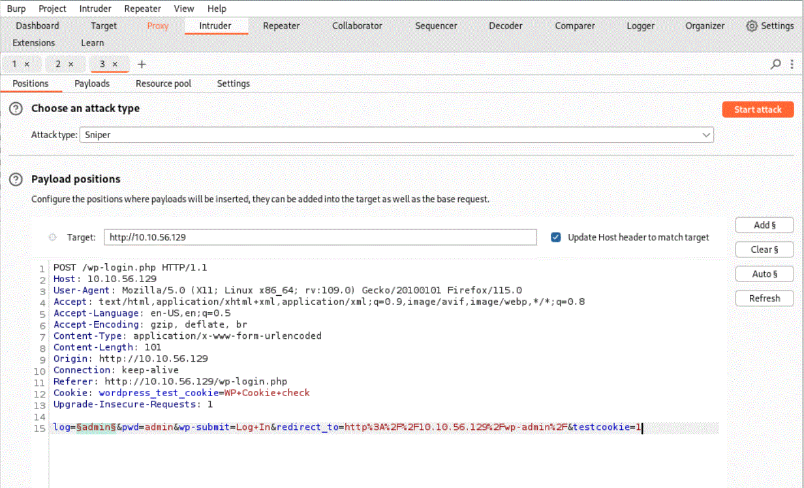
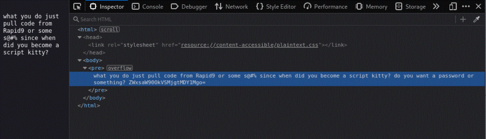

# Mr. Robot CTF Walkthrough

A CTF based on the Mr. Robot show created by TryHackMe co-founder [ben](https://tryhackme.com/p/ben). This walkthrough covers my methodology for rooting the Mr. Robot room. Let's get started!

Room Difficulty: Medium

Room URL: https://tryhackme.com/r/room/mrrobot
## Initial Enumeration

Upon accessing the IP address, you're presented with a boot-up screen that ends up at what appears to be a simulated IRC terminal environment with various commands available:

- **prepare**: Plays a propaganda video for fsociety (whoismrrobot.com). 
- **fsociety**: Another join fsociety clip.
- **inform**: Displays news clippings about overvalued people in society, all timestamped 10:46.
- **question**: More propaganda slides.
- **wakeup**: A clip from the show Mr. Robot.
- **join**: A message from Mr. Robot requesting an email address to join, timestamped 21:40. Using `invalid@invalid.com` yielded a response saying "we will be in touch."

These were all fun to watch, but I didn't find any really useful information or leads here. Time to explore some further enumeration.

### Nmap Scan

```bash
sudo nmap -sC -sV MACHINE_IP -oN nmap
```

**`-sC`**: Runs a set of default scripts during the scan. These scripts, part of the Nmap Scripting Engine (NSE), are designed to perform various tasks such as gathering information about the target, detecting vulnerabilities, and checking for common services and configurations. The `-sC` option is equivalent to `--script=default`.
    
 **`-sV`**: Probe open ports to determine service/version info.


                          
*No obviously useful results.*

### Gobuster Scan

```bash
gobuster dir -u http://MACHINE_IP -w /usr/share/wordlists/dirb/common.txt
```

**Explored Results:**
- `/login` - WordPress 4.3.1 blog found.
- `/license` - Appears to be a quote from the show:
"what you do just pull code from Rapid9 or some s@#% since when did you become a script kitty?"
- `/image` - A picture of the fsociety anon figure.
*tried dropping this into cyberchef for a quick steg check, but no luck.*

I tried using default credentials `admin/admin` with no success. I also considered using BurpSuite or exploring Remote Code Execution (RCE) vulnerability found on ExploitDB as next steps.

## Discovery of fsocity.dic and First Key
**Hint 1:** "*robots*"
Without a clear direction forward, this hint was actually super helpful. 
#### Visit `http://MACHINE_IP/robots.txt`

- **/robots**: Revealed two more directories `/fsocity.dic` and `/key-1-of-3.txt`.
- Visit MACHINE_IP/fsocity.dic 
	- **Downloaded** `fsocity.dic` (a wordlist)
- MACHINE_IP/key-1-of-3.txt
	- Gives us the first key and the answer to question 1

**ANSWER 1: `073403c8a58a1f80d943455fb30724b9`

Next step is trying to figure out what I'm supposed to do with this wordlist `fsocity.dic`
I was guessing some sort of Hydra brute force attack.
## WordPress Login and Second Key

**Hint 2**: "There's something fishy about this wordlist. Why is it so long?"
858K+ lines??? Whoa! 
I don't even want to think about using a list that big for brute force efforts. I sorted and removed duplicates, which shortened the wordlist to 11451 lines.  

```bash
sort fsocity.dic | uniq > new.dic
```

I saved the output of this as a new wordlist called "new.dic" for later use. 

Visiting `http://MACHINE_IP/login` and tried using admin/admin as default credentials just to see what it does. 


This is interesting because it returns an overly specific error message "Invalid username." We can use this to our advantage to identify that we've correctly brute-forced the username, assuming it will then give us a different error message after receiving the expected username input. 

Now we're going to Open Burp Suite and use Proxy to Intercept the same default credential request with admin/admin as our input. 


### Brute Force Username


Then we will send this capture to Intruder. Highlight the username "admin" and click Add payload. Click on the payloads tab up top and scroll down to "Payload settings. Click load to select your wordlist to use as a payload. We will be using our "new.dic" file to try and brute force a username. 



Now just click **Start Attack**. Grab some coffee, this may take a while. Even though we've significantly shortened our wordlist from the original version, it's still pretty hefty. 

What we'll be looking for in the results is any words that return anomalous response lengths. The standard length I'm seeing over and over is 4098 bytes, so I'm assuming that's the length of the original "Invalid username" response we received earlier. We can check just to be sure, since we have some time : )

Send the captured POST request from Proxy to Repeater. Look to the bottom right corner the Burp Suite window and you should see something like: `Done            4,098 bytes | 1,132 millis`

As I'm sitting here reflecting on my choices, I'm wondering if there's a way to speed this along. While in a real world scenario I might be inclined to sacrifice time for thoroughness, doing it in a CTF kind of kills your momentum. How can I shorten this payload to get faster results?

***Stay Tuned** -At the end I'll show you something I learned from someone else's walkthrough that is probably the fastest route to finding the WP credentials.*

### Speed Up Our Progress

**OPTION 1** 
I could try to shorten "new.dic" even further. The question is "how?" As of now I have a wordlist that, while it is long, it has no duplicates. So it contains all unique possibilities for a username or password. Here is where we'll be sacrificing some of that thoroughness we'd want to keep in the real world. There is a possibility that we'll miss the right username, but here's what I'm thinking: How do people typically format their usernames? Typically they are not purely numerical right? Well looking at the contents of the wordlist, there's a lot of purely numerical lines Intruder is going to be trying as usernames. Okay so let's alter our "new.dic" based on our assumption that we can filter out purely numerical lines, as they are unlikely to be usernames.

`grep -v '^[0-9]*$' new.dic | sort > newer.dic

Great now we have a shorter wordlist, which means faster brute forcing. But it's only shorter by a couple thousand lines. That means there's still 9k of possible usernames. Let's see if we can narrow it down even further. I can't think of any other options to significantly reduce the size of the wordlist that make sense in the context of 'typical username structure'. Well let's take a risk. Let's see if the username is purely alphabetical. Worst thing that could happen is we accidentally remove the username from the wordlist and don't get any valid brute force results. 

`grep -v '[0-9]' new.dic | grep '^[a-zA-Z]*$' > newer.dic`

Well let's check to see how that reduced our wordlist line count.
`wc -l newer.dic`
`7835 newer.dic`

Well that's a couple thousand more lines filtered out. Not bad. I think that's probably about as small as we can reasonably make the wordlist by filtering things out. What's left is almost entirely legitimate words that could conceivably be used as a username. 

Results:

Here you can see the difference in Response Length, which means "Elliot" is a likely choice for our username. 

**OPTION 2** 
I could try Hydra to see if that yields faster results. Spoiler...It does. 


Here I used the -L flag with our wordlist "new.dic" and the -p flag  with "null" as simply a place holder for the password input. The http-post-form input can be surmised from our original Burp Suite request in proxy.


The syntax for the http-post-form in Hydra requires three inputs separated by colons(`:`):

Ex. `path_to_login_form:parameters_for^USER^ and ^PASS^:failed_attempt_response`

1. **Path to Login Form**:
    
    - This is the relative path to the form on the website that processes the login request. For WordPress, it is typically `/wp-login.php`.
2. **Parameters**:
    
    - These include the parameters required for the login request. The placeholders `^USER^` and `^PASS^` are used by Hydra to inject usernames and passwords from the provided wordlists.
    - The parameters should match the form field names in the HTML form. For WordPress, these are commonly `log` for the username and `pwd` for the password.
3. **Failure Message**:
    
    - This is the string that appears on the page when a login attempt fails. Hydra uses this string to identify unsuccessful login attempts. It helps Hydra determine if the credentials were incorrect.

From our Burp Suite request we derived the following input for our http-post-form:

`"/wp-login.php:log=^USER^&pwd=^PASS^:The password you entered for the username"`

Now that we have the Username "Elliot" we can work on brute forcing the password. 


### Brute Force Password

Use Hydra to brute force the password for the user Elliot:

```bash
hydra -l Elliot -P new.dic MACHINE_IP http-post-form "/wp-login.php:log=^USER^&pwd=^PASS^:The password you entered for the username" -t 30 -f
```

**Credentials found:**
- **Username**: Elliot
- **Password**: ER28-0652

## Access to WordPress

I logged into Elliot's account and explored the WordPress dashboard where I identified two users:


I clicked on Krista's user profile and found a website link:
http://mrrobot.wikia.com/wiki/Krista_Gordon
Her bio reads "another key?"

Neither of these are very useful. The website is an external link to a wiki-fandom page.
The bio, while cryptic and taunting, is not very helpful. 

Well, it's WordPress right? Why not try to get a reverse shell by uploading a malicious post!
After clicking around the dashboard I noticed there is an "editor" option in the Appearance tab. As far as I can tell, this is the only place where it will actually allow you to upload anything. I think this is an  intentional design in the CTF to help guide us to a specific area/ method of exploitation. I tried various other locations first, such as, posts and pages with no luck in uploading any files. 

After selecting "editor," you’ll be presented with a template that includes comments and HTML code. On the right-hand sidebar, there is a list of available templates for editing. The presence of code in this initial template suggests that any changes made here will likely be executed when the corresponding page is accessed.  The first template in the list on the right-hand sidebar is the 404 template, which is typically displayed to users when they encounter a "Page Not Found" error on the website. Modifying this template could potentially allow for executing custom code when a 404 error page is triggered.


It's written in PHP, so let's replace it with a PHP reverse shell from https://www.revshells.com/
## Shell Access and Key 2
#### Reverse Shell via WordPress

1. **Appearance > Editor > 404 Template**: Added PHP reverse shell code and clicked the "Update File" button below the code block.
2. **Started listener** on local machine. `nc -lvnp 4445`
3. **Triggered shell** by visiting `http://MACHINE_IP/404`.

Now that we have our reverse shell, let's upgrade it!

```bash
python -c 'import pty;pty.spawn("/bin/bash")'
stty raw -echo
```

Now that we've gained access, let's make our way to the home folder, a common directory for finding flags, clues, etc. post foothold.  

`cd home`

Only one user, that makes our job easy.

`cd robot`

Found `key-2-of-3.txt` and `password.raw-md5` in `/home/robot`:

So here we have a .txt file that we do not have permissions to open and an MD5 hash that we can open. In order to read key 2 we will have to elevate our privileges by switching to the user Robot. 

`cat password.raw-md5`
`robot:c3fcd3d76192e4007dfb496cca67e13b`

This file looks like a formatted string of `username : encrypted password`

Let's decrypt it! I think https://hashes.com/en/decrypt/hash is a great resource for CTFs.


- **Decrypted MD5 hash**: `abcdefghijklmnopqrstuvwxyz`
- **Switched to user robot**:

```bash
su robot
password: id
```

**Second key:**
```plaintext
822c73956184f694993bede3eb39f959
```

Success!
## Privilege Escalation and Third Key

**HINT 3**: "nmap" 

At first this hint was very cryptic and I wasn't sure how helpful it was going to be. At this point I didn't have any more leads on what to do next to get the final key except this cryptic hint "nmap." I'm assuming I need to escalate privileges to root somehow to get the final key. A quick google search "nmap privilege escalation" lead me to https://gtfobins.github.io/gtfobins/nmap/
Here we find a variety of ways to use nmap to escalate our privileges. 

After realizing the SUID bit was set for nmap, I tried gtfo bins' escalation method. 


Unfortunately, this method didn't work for me. I could have tried a few more times to troubleshoot the issue, but feeling frustrated, I decided to do some further research. That's when I stumbled upon a particularly helpful blog: https://www.adamcouch.co.uk/linux-privilege-escalation-setuid-nmap/

#### Nmap SUID Privilege Escalation

Find nmap with SUID bit set:

```bash
find / -user root -perm -4000 -exec ls -la {} \;
```

Entered nmap interactive mode:

```bash
nmap --interactive
```

Executed shell commands as root:

```bash
nmap> !sh
# id
uid=1002(robot) gid=1002(robot) euid=0(root) groups=0(root),1002(robot)
```

## Obtaining Third Key

After gaining root privileges I navigated to the /root directory and found `firstboot_done` and `key-3-of-3.txt`:
The `firstboot_done` is a 0kb file. Sort of a congratulations for getting here I suppose : )
You can cat the .txt file for the third key.

**Third key:**
```plaintext
04787ddef27c3dee1ee161b21670b4e4
```

Congratulations! You've rooted the machine!

## Bonus Findings

When it comes to finding our credentials for the WordPress login form, there is in fact a much faster way. I found this from reviewing others' write-up of this room out of curiosity. 
Let's start by visiting `http://MACHINE_IP/license`
At first glance, it's just a quote from the show. Open up inspector. 


Notice that? 
If you double-click into the "pre" field it reveals even more. It allows you to scroll down revealing more than is visible here. For ease of reading I've condensed it below:
```
what you do just pull code from Rapid9 or some s@#% since when did you become a script kitty?
do you want a password or something?
ZWxsaW90OkVSMjgtMDY1Mgo=
```
I dropped the variable string into hashes.com/en/decrypt/hash to see what it is. 
You can use the identifier feature first, but its not necessary. However it is a Base64 Encoded String.
The decoded result: `ZWxsaW90OkVSMjgtMDY1Mgo=:elliot:ER28-0652`

Wow, that was way faster! I wish I'd figured this out while completing the room!
## Conclusion

The Mr. Robot room on TryHackMe was fun, immersive, and challenged me to think critically combining elements of enumeration, web exploitation, password cracking, and privilege escalation. I enjoyed all the cryptic references and hints. It was a healthy ratio of red herrings that threaten to lead you astray, or at least to a dead end, and subtly useful hints that guide you along the right path. This room is rated as a "medium" room on TryHackMe, but I think it's equally as appropriate for beginners that have finished the "Complete Beginners" learning path. At that point you probably have enough exposure to various tools and techniques to be able to complete this room. 


### Security Lessons Learned (or reminded)

- Overly-specific error codes should be avoided with secure coding practices, as they provide the attacker means of enumerating their efforts. 
- Usernames with complexity, just like passwords, make the attacker's job harder. Don't give them an easy win. 
- Don't leave passwords resting in insecure locations. Use strong encryption. 


 ***Let me know what you think. I would love your feedback, and I especially would love to know if you found something I didn't!*** 
